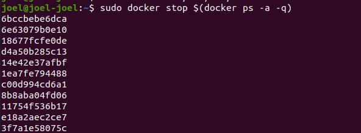
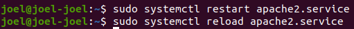
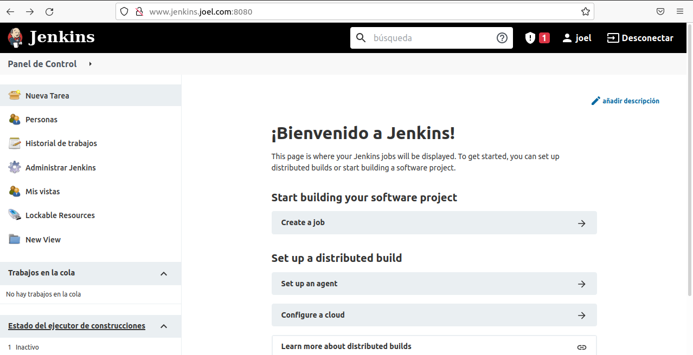
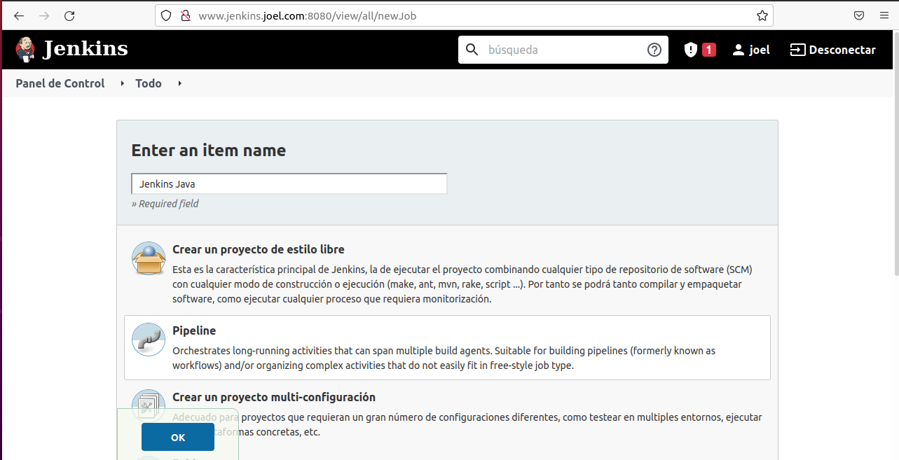
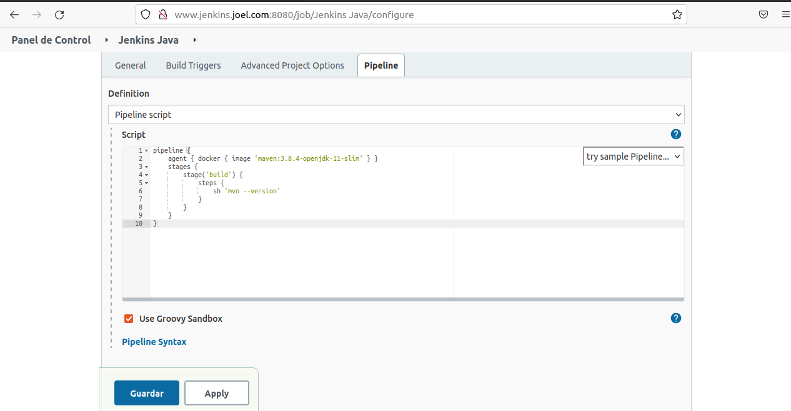
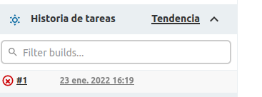
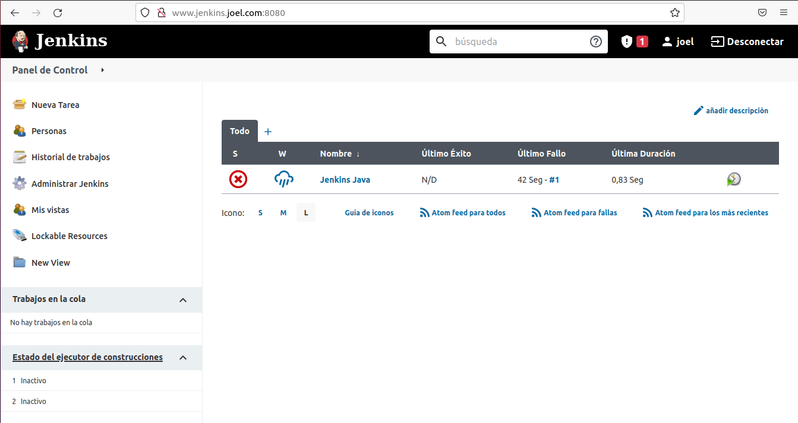
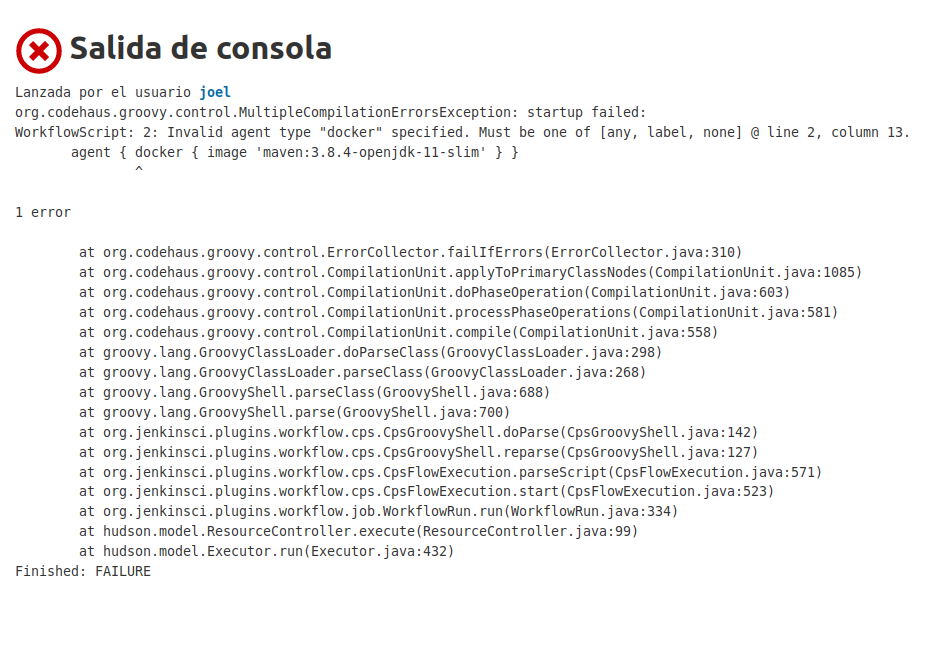

# Índice #

## 1. Requisitos básicos ##

## 2. Creación de Pipelines ##

- ### 2.1 Java ###
- ### 2.2 Node.js ###
- ### 2.3 Ruby ###
- ### 2.4 Python ###
- ### 2.5 PHP ###
- ### 2.6 GO ###

**1. Requisitos básicos**

- 
Tener jenkins instalado

- 
Tener los contenedores de docker jenkins parados, para eso utilizamos el metodo cortar por lo sano paramos todos los contenedores docker y así no tenemos ningún tipo de problema con el comando 

Si tenemos problemas de permisos ejecutaremos el siguiente comando

Luego los paramos

Posteriormente reiniciamos el servicio apache y jenkins

Luego reiniciamos nuestra máquina virtual

**2. Creación del Pipelines**

Accedemos a jenkins

Se mostraran los diferentes pasos para la creación de los tipos de lenguajes

***2.1. Java***

Creación de Pipeline en Java

Clickeamos en nueva tarea

Definimos el nombre del pipeline

En la opcion de pipeline, nos vamos a script y pegamos el script  de la siguiente imagen

Una vez guardado, pulsamos la opcion contruir ahora

Nos dara un error en el proceso

Este es el error que sale por consola 

***2.2. Node.js***

Creación de Pipeline en Node.js

***2.3. Ruby***

Creación de Pipeline en Ruby

***2.4. Python***

Creación de Pipeline en Python

***2.5. PHP***

Creación de Pipeline en PHP

***2.6. GO***

Creación de Pipeline en GO

Enlace github: <a href="https://github.com/joel92MM/Git/tree/main/2ºTrimestre/ConfiguracionPipeline">enlace</a>
