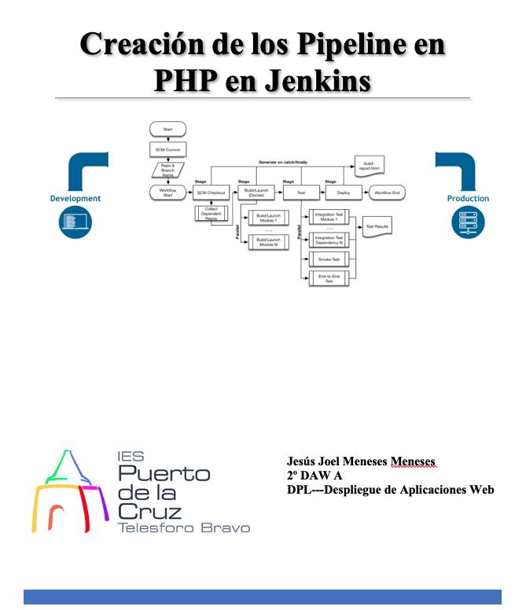

# Índice #

## 1. Requisitos básicos ##

## 2. Creación de ficheros en GitHub ##

## 3. Creación de el Pipeline ##

**1. Requisitos básicos**

- 
Tener jenkins instalado

**2. Creación de ficheros en GitHub**

Creamos un repositorio en nuestra cuenta de github, de nombre php-helloworld.

Clonamos el proyecto en local

Creamos la carpeta src. Añadimos dentro un fichero index.php, , que contenga contenido en el lenguaje php y una imagen personalizada con nuestro nombre.

Volvemos a la raiz de nuestro proyecto.

Creamos el fichero Dockerfile. Incluye el siguiente contenido

> FROM php:IMAGEN OFICIAL DE PHP 
> COPY src/ /var/www/html  
> EXPOSE 80

**3. Creación de el Pipeline**

Creamos el fichero Jenkinfile, que tenga como misión realizar el despliegue. Tiene que tener acciones similares a las siguientes...

> git clone this repository
> sudo docker build -t hello-word-php-apache
> sudo docker run -p 80:80 hello-word-php-apache

Realizamos un push con todos los cambios.

Creamos el Pipeline dentro de tu instalación de Jenkins.alumno, sincronizando desde tu cuenta de github (www.github.com/alumno/hello-word-php-apache.git) o similar.

Ejecutamos el Pipeline, y verificar que se ha realizado de forma correcta visualizando el navegador.

v

v

Enlace github: <a href="https://github.com/joel92MM/Git/tree/main/2ºTrimestre/ConfiguracionPipelinePHP">enlace</a>
