

# Índice #

## 1. Requisitos básicos ##

## 2. Creación de ficheros en GitHub ##

## 3. Creación de el Pipeline ##

**1. Requisitos básicos**

- 
Tener jenkins instalado

**2. Creación de ficheros en GitHub**

Creamos un repositorio en nuestra cuenta de github, de nombre php-helloworld.

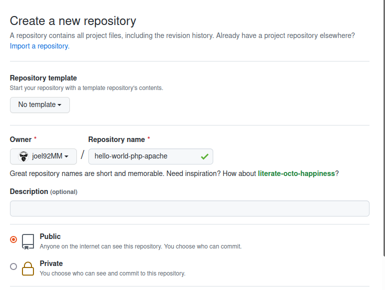
 
 

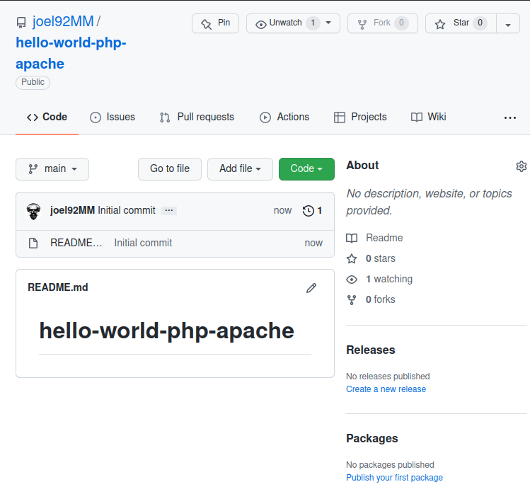
 
 

Clonamos el proyecto en local con el siguiente comando..

> git clone [url_repositorio]

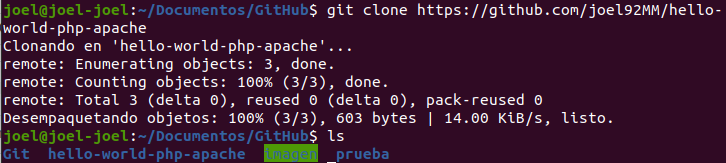
 
 

Creamos la carpeta src, añadimos dentro un fichero index.php, que contenga contenido en el lenguaje php y una imagen personalizada con nuestro nombre.

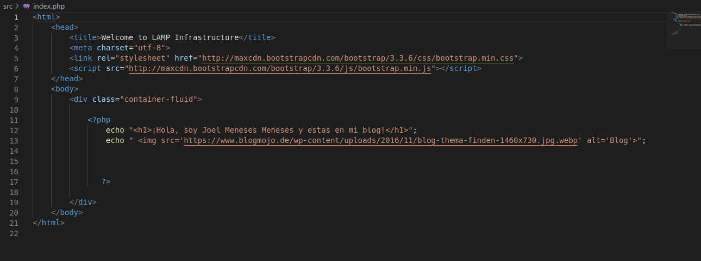
 
 

Creamos el fichero Dockerfile. Incluye el siguiente contenido

> FROM php:IMAGEN OFICIAL DE PHP 
> COPY src/ /var/www/html  
> EXPOSE 80

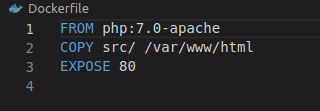
 
 

**3. Creación de el Pipeline**

Creamos el fichero Jenkinfile, que tenga como misión realizar el despliegue. Tiene que tener acciones similares a las siguientes...

> git clone this repository
> sudo docker build -t hello-word-php-apache
> sudo docker run -p 80:80 hello-word-php-apache

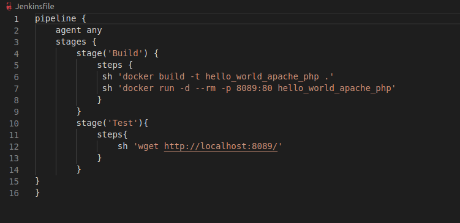
 
 

Realizamos un push con todos los cambios.

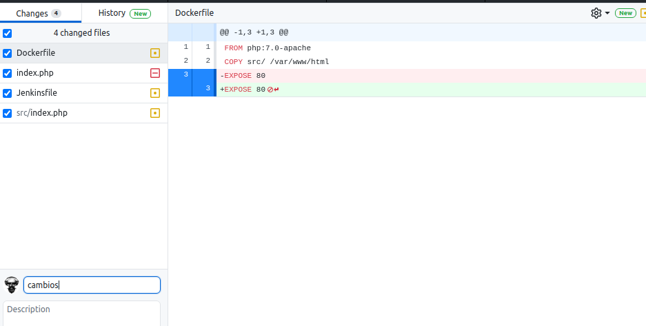
 
 

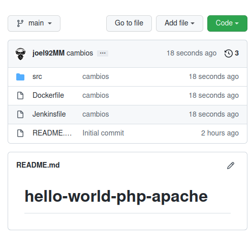
 
 

Creamos una nueva tarea Pipeline

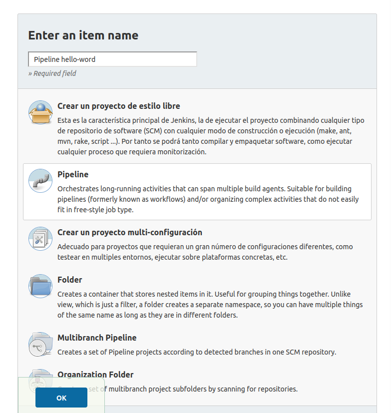
 
 

Luego nos vamos a la seccion pipeline, en la pestaña definicion cambiamos el valor y en la de SCM tambien a como se muestra en la siguiente imagen

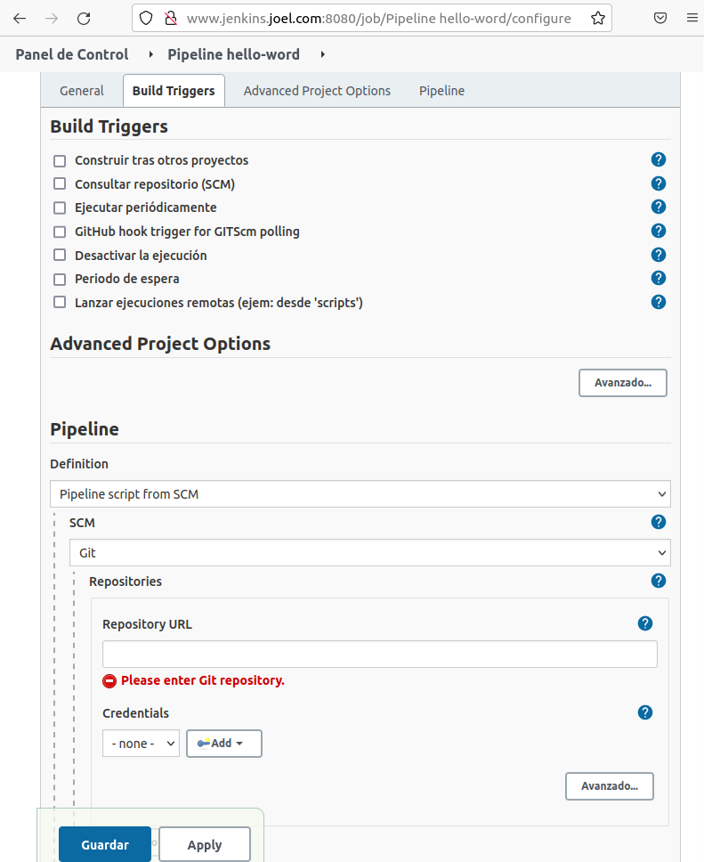
 
 

Luegos sincronizamos la cuenta de github

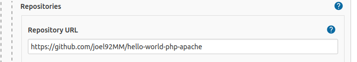
 
 

En la pestaña añadir, añadimos las credenciales de nuestro github, usuario y contraseña

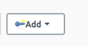
 
 

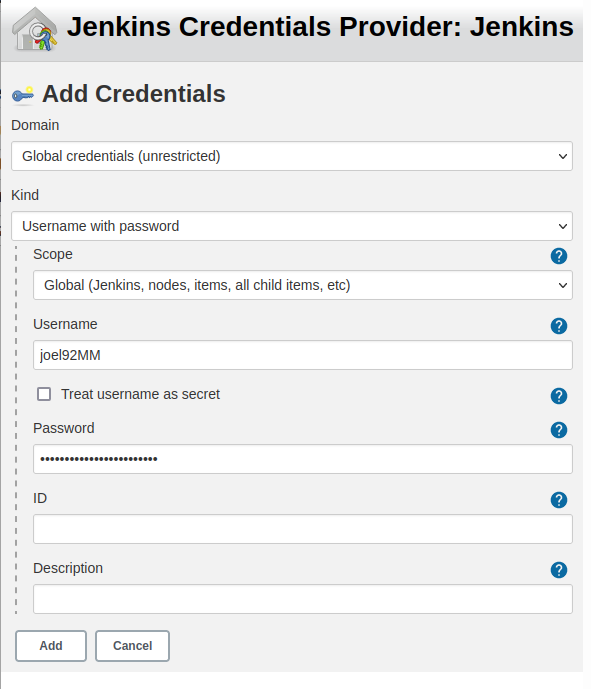
 
 

Modificamos los siguientes valores en las pestañas como se muestra en la imagen

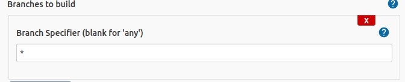
 
 

 
 

Se nos muestra el pipeline solo falta construirlo

 
 

Ejecutamos el Pipeline

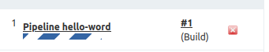
 
 

Comprobamos el estado 

 
 

verificamos que se ha realizado de forma correcta visualizando el navegador.

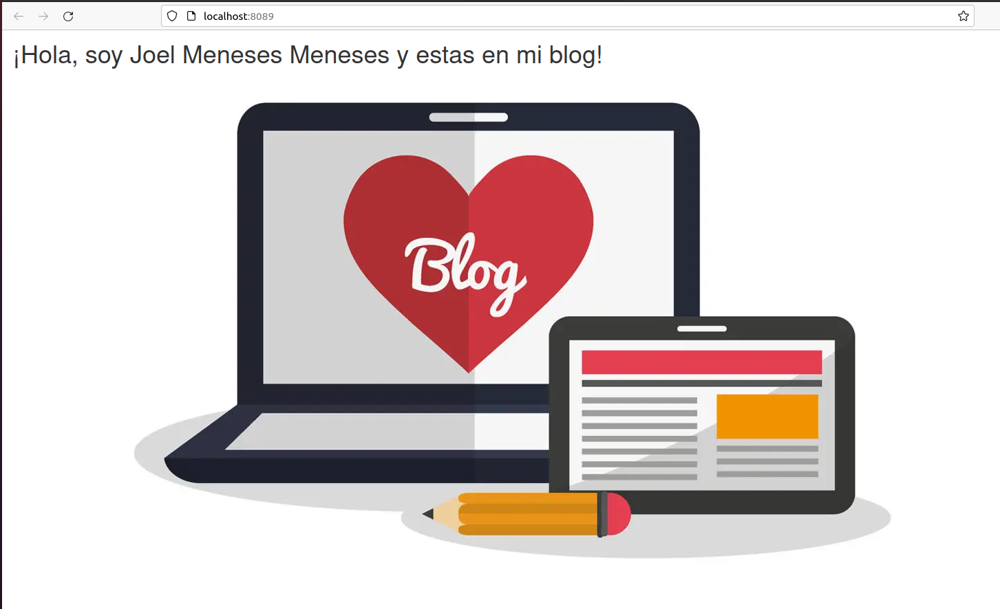
 
 

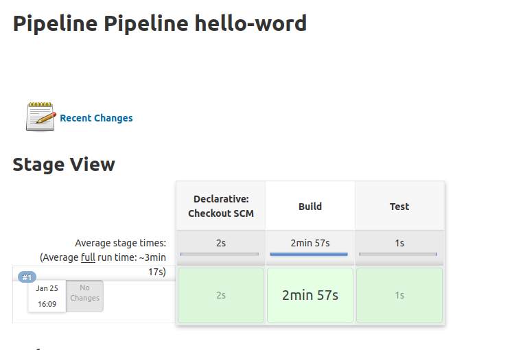
 
 

Enlace github: <a href="https://github.com/joel92MM/Git/tree/main/2ºTrimestre/ConfiguracionPipelinePHP">enlace</a>
