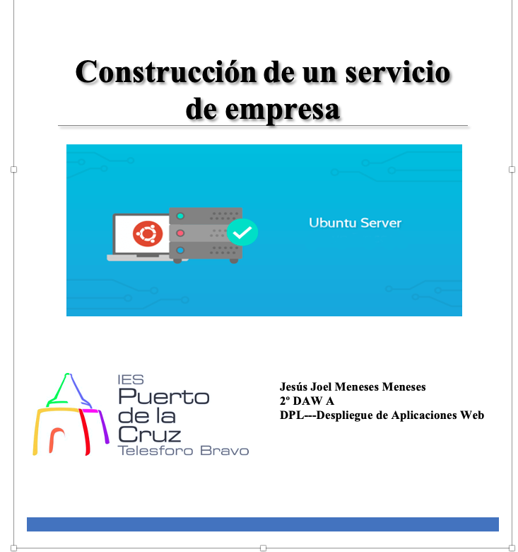
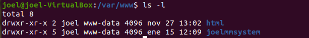
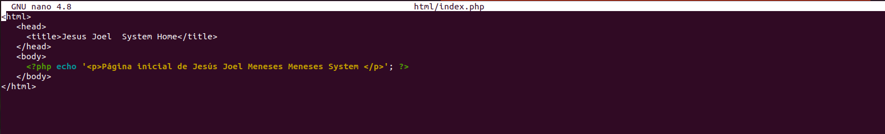
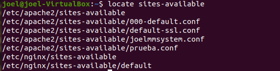
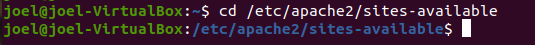
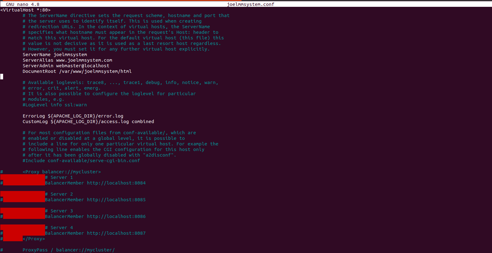
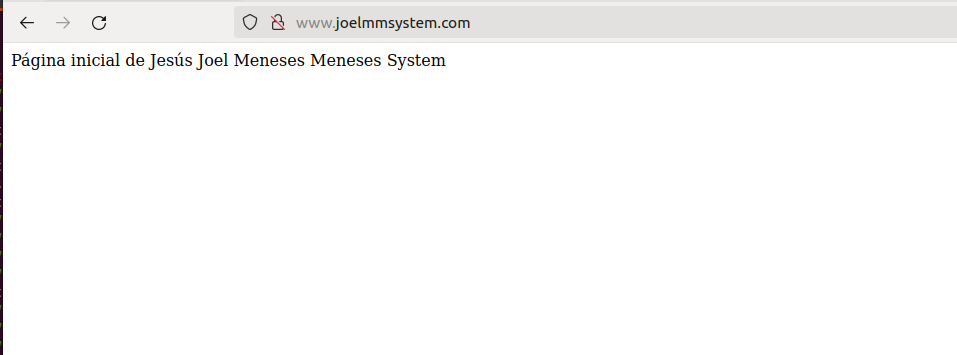
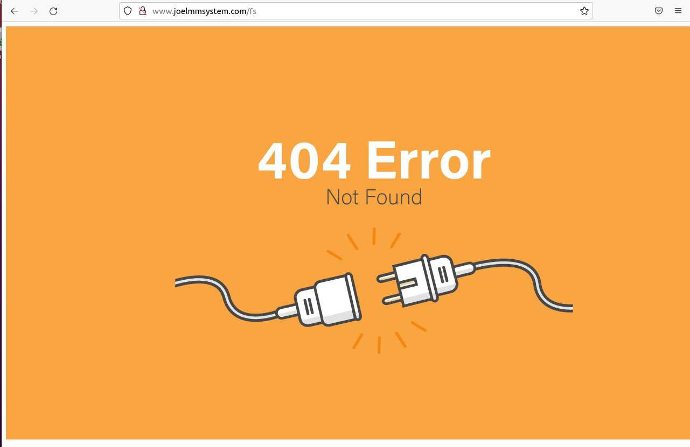

# Índice #

## 1. Requisitos básicos ##

## 2. Crear dominio ##

- ### 2.1 Configurar dominio y puertos ###

## 3. Crear subdominio ##

- ### 3.1 Configurar subdominio ###

## 4. Instalar PHP ##

## 5. Instalar MYSQL ##

## 6. Instalar PHPMYADMIN ##
- ### 6.1 Configurar phpmyadmin  ###

**1. Requisitos básicos**

- Disponer de una máquina Ubuntu 20.04
- Internet
- Disponer de un servidor FTP.
- Disponer de Apache instalado

**2. Crear dominio**

En primer lugar crearemos la carpeta con el nombre de dominio, que se encuentra en /var/www/ seguido del nombre de dominio ejemplo **joelmmsystem**, lo hacemos con el siguiente comando

> mkdir -p /var/www/joelmmsystem

Asignaremos los siguientes permisos a la carpeta con el siguiente comando

> chmod -R 755 /var/www/joelmmsystem

A continuación dentro de la carpeta *joelmmsystem* crearemos la carpeta html que contendrá la pagina principal de nuestro dominio

> mkdir -p /var/www/joelmmsystem/html
> sudo nano /var/www/joelmmsystem/html/index.php

El contenido del index.php será el siguiente: 

Dentro de la carpeta **html** crearemos la carpeta *errors* que contendrá los archivos para controlar los mensajes de los errores

Ahora vamos al archivo de configuración

Localizamos la ruta del archivo sites-available con el siguiente comando

> locate sites-available

Entramos en la ruta 

 
 

- ***2.1 Configurar dominio y puertos***

Crearemos nuestro archvo de configuracion inicial, copiado del original de apache, cuyo nombre sera *joelmmsystem.conf*

Entramos en el archivo de configuracion creado anteriormente con el comando...

> sudo nano joelmmsystem.conf

Configuramos lo siguiente: 

> NombreServidor: joelmmsystem
> AliasServidor: www.joelmmsystem.com
> DocumentRoot /var/wwww/joelmmsystem/html

Directorio de la carpetas y permisos

>  <Directory /var/www/joelmmsystem/html>  
        Options Indexes FollowSymLinks 
        AllowOverride None 
        Require all granted 
>    /Directory>  

Archivo de errores

> ErrorDocument 404 /errors/error404.html

Guardamos la configuración CTRL+O Y CTRL+X

Habilitamos la configuracion con el comando 

> sudo a2ensite joelmmsystem.conf

Ahora habilitamos el puerto, entramos en la carpeta hosts, con el comando..

>sudo nano /etc/hosts/

Reiniciamos nuestro servidor apache con el comando

> sudo systemctl reload apache2.service

Ahora en nuestro navegador ponemos nuestro dominio y se nos mostrara una pagina similar a la siguiente

Y si introducimos una direccion erronea, se nos mostrara un mensaje de error personalizado

**3. Crear subdominio**

**4. Instalar PHP**

**5. Instalar MYSQL**

**6. Instalar PHPMYADMIN**

