

# Índice #

## 1. Requisitos básicos ##

## 2. Crear dominio ##

- ### 2.1 Configurar dominio y puertos ###

## 3. Crear subdominio ##

- ### 3.1 Configurar subdominio ###

## 4. Instalar PHP ##

## 5. Instalar MYSQL ##

## 6. Instalación y configuración de PHPMYADMIN ##

## 7. Instalación y configuración de SFTP ##

**1. Requisitos básicos**

- Disponer de una máquina Ubuntu 20.04
- Internet
- Disponer de un servidor FTP.
- Disponer de Apache instalado

**2. Crear dominio**

En primer lugar crearemos la carpeta con el nombre de dominio, que se encuentra en /var/www/ seguido del nombre de dominio ejemplo **joelmmsystem**, lo hacemos con el siguiente comando

> mkdir -p /var/www/joelmmsystem

Asignaremos los siguientes permisos a la carpeta con el siguiente comando

> chmod -R 755 /var/www/joelmmsystem

A continuación dentro de la carpeta *joelmmsystem* crearemos la carpeta html que contendrá la pagina principal de nuestro dominio

> mkdir -p /var/www/joelmmsystem/html  
> sudo nano /var/www/joelmmsystem/html/index.php

El contenido del index.php será el siguiente: 

Dentro de la carpeta **html** crearemos la carpeta *errors* que contendrá los archivos para controlar los mensajes de los errores

Ahora vamos al archivo de configuración

Localizamos la ruta del archivo sites-available con el siguiente comando

> locate sites-available

Entramos en la ruta 

 
 

- ***2.1 Configurar dominio y puertos***

Crearemos nuestro archvo de configuracion inicial, copiado del original de apache, cuyo nombre sera *joelmmsystem.conf*

Entramos en el archivo de configuracion creado anteriormente con el comando...

> sudo nano joelmmsystem.conf

Configuramos lo siguiente: 

> NombreServidor: joelmmsystem  
> AliasServidor: www.joelmmsystem.com  
> DocumentRoot /var/wwww/joelmmsystem/html  

Directorio de la carpetas y permisos

>  <Directory /var/www/joelmmsystem/html>  
        Options Indexes FollowSymLinks 
        AllowOverride None 
        Require all granted 
>    /Directory>  

Archivo de errores

> ErrorDocument 404 /errors/error404.html

Guardamos la configuración CTRL+O Y CTRL+X

Habilitamos la configuracion con el comando 

> sudo a2ensite joelmmsystem.conf

Ahora habilitamos el puerto, entramos en la carpeta hosts, con el comando..

>sudo nano /etc/hosts/

Reiniciamos nuestro servidor apache con el comando

> sudo systemctl reload apache2.service

Ahora en nuestro navegador ponemos nuestro dominio y se nos mostrara una pagina similar a la siguiente

Y si introducimos una direccion erronea, se nos mostrara un mensaje de error personalizado

**3. Crear subdominio**

Creamos una carpeta dentro de joelmmsystem

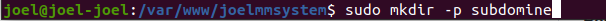

Estructura de carpetas de joelmmsystem

Posteriormente vamos al archivo de configuración y lo editamos para que acceda a la carpeta 

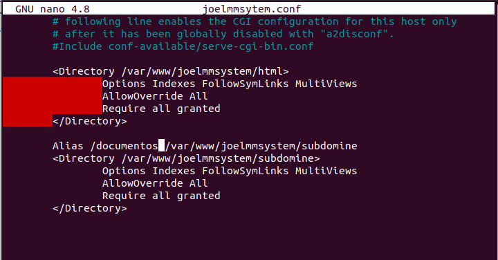

Finalmente ya tenemos la carpeta configurada como subdominio

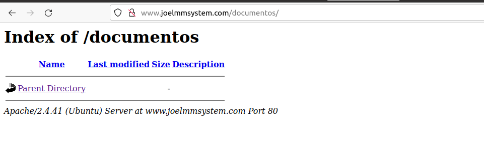

**4. Instalar MYSQL**

Antes de instalar mysql, actualizaremos los repositorios de nuestro sistema con el comando..

> sudo apt update && apt upgrade

Ahora procederemos a instalar mysql con el comando..

> sudo apt-get install mysql-server

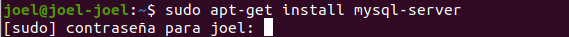

Presionamos la tecla S y continuamos 

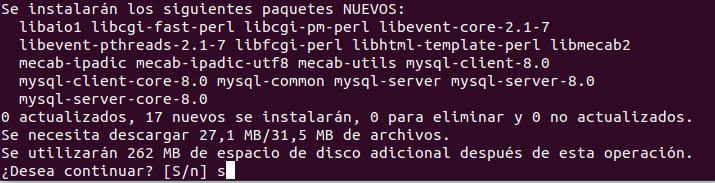

Tardara unos minutos 
+

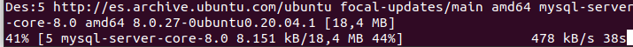

Ahora ejecutaremos un script simple de seguridad que nos permite eliminar algunas configuraciones peligrosas y bloquear un poco el acceso a nuestro sistema de BBDD, con el siguiente comando...

> sudo mysql_secure_installation

A continuación se muestran los pasos a seguir: 

Presionamos la tecla n en cada opción..

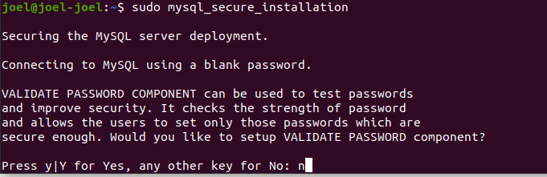

Introduciremos la nueva contraseña, en nuestro caso sera 123456789

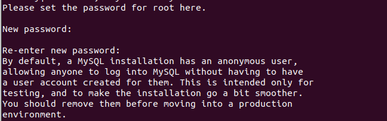

Seguimos con la instalación

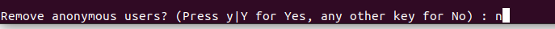

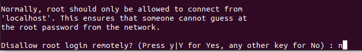

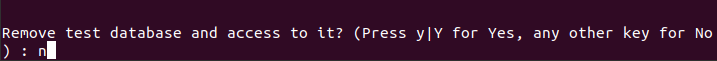

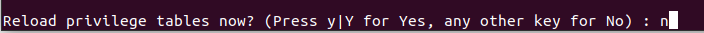

Si hemos realizado los pasos correctamente se nos mostrara un mensaje similar al siguiente

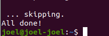

**5. Instalar PHP**

Incluimos algunos paquetes de ayuda, para que el codigo PHP se pueda ejecutar en el servidor Apache y hablar con nuestra base de datos MYSQL, con el siguiente comando..

> sudo apt-get install php libapache2-mod-php php-mysql

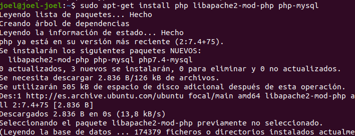

Buscamos y editamos el archivo dir.conf para ello usamos el siguiente comando...

> locate dir.conf

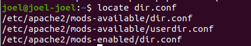

Entramos en la ruta para modificar el archivo, queriendo que apache busque primero archivos .php, se vera de forma similar a la siguiente imagen

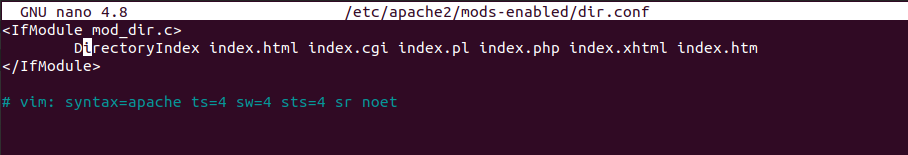
  
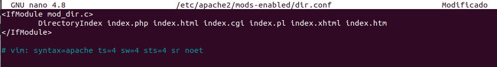

Luego recargamos la configuración de apache con el siguiente comando..

> sudo systemctl reload apache2.service

Comprobamos que se muestra en nuestro navegador

**6. Instalación y configuración de PHPMYADMIN**

Nuevamente actualizaremos los repositorios de nuestro sistema con el comando..

> sudo apt-get update

Ahora descargaremos phpmyadmin con el siguiente comando, el cual nos guiara por unos pasos que detallo a continuacion, el comando es..

> sudo apt-get install phpmyadmin php-mbstring

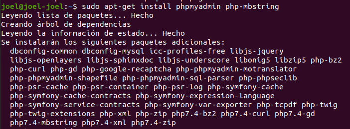

En la primera pregunta pulsamos la tecla Y, posteriormente se nos mostrara una ventana como la de la imagen

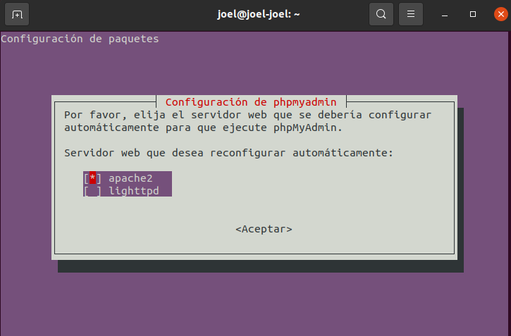

Seleccionamos la primera opcion con la tecla barra espaciadora y seguimos

Se nos preguntara si queremos configurar la base de datos para phpmyadmin pulsamos que si y continuamos

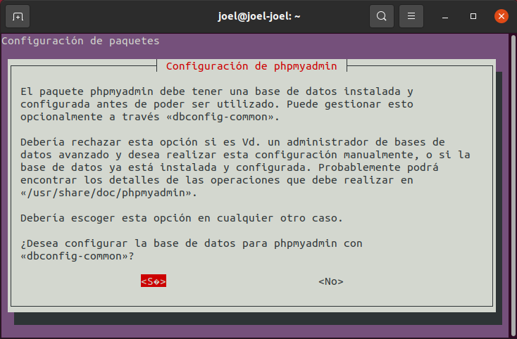

Ingresamos la nueva contraseña para mysql

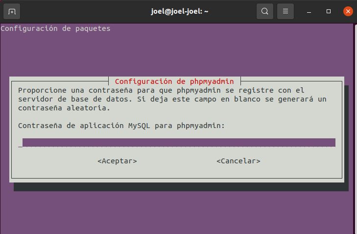

Confirmamos contraseña anterior

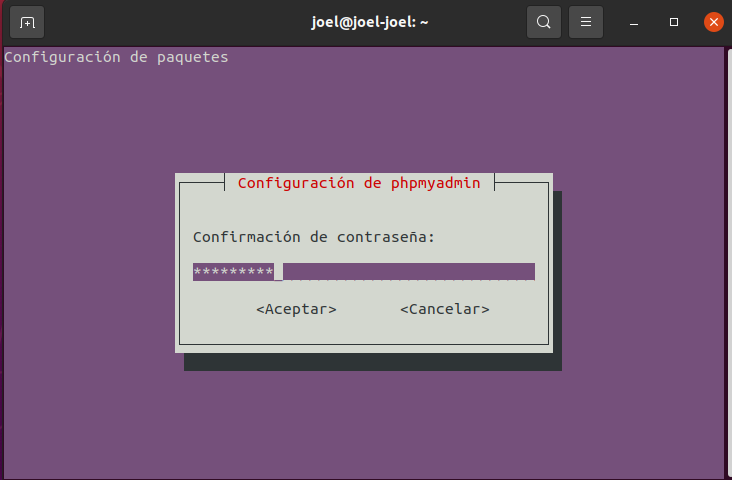

Ahora habilitamos las extensiones de php con los siguientes comandos..

  
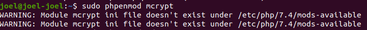

Reiniciamos nuestro servidor apache

Iremos a nuestro navegador y entramos en phpmyadmin, ingresamos con usuario root y nuestra contraseña y nos mostrara un mensaje de error como el siguiente

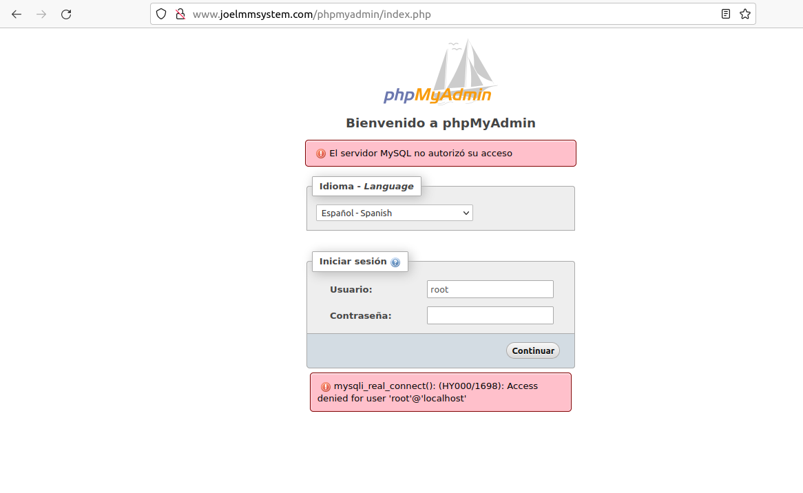

La solución son los siguientes pasos

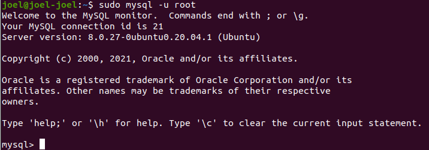
 
 
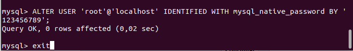
 
 

 
 

Finalmente volveremos a introducir el usuario y contraseña y entraremos en phpmyadmin

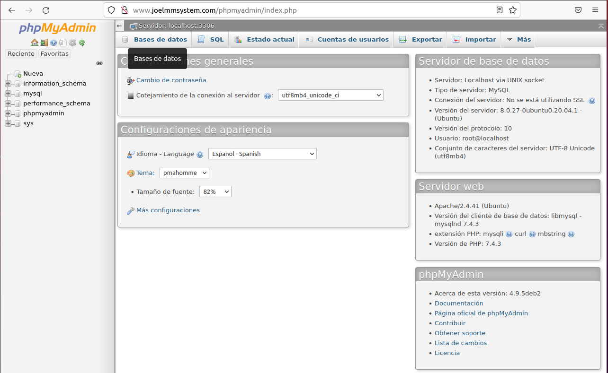

Una vez dentro, procederemos a crear un nuevo usuario, nos vamos a la pestaña cuenta de usuario, bajando nos encontraremos con Agregar cuenta de usuario

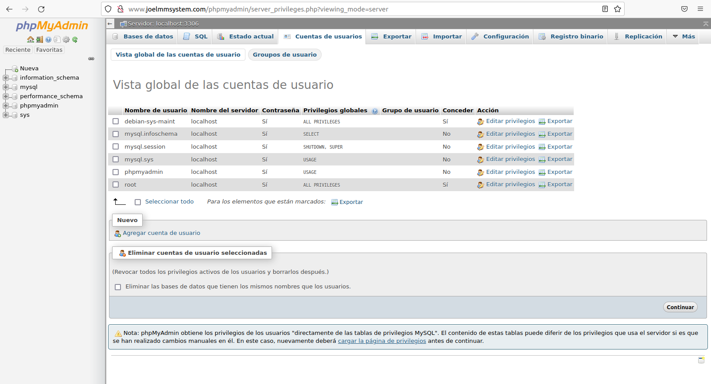

Agregaremos al nuevo usuario, con su contraseña y los privilegios globales, y pulsamos en continuar..

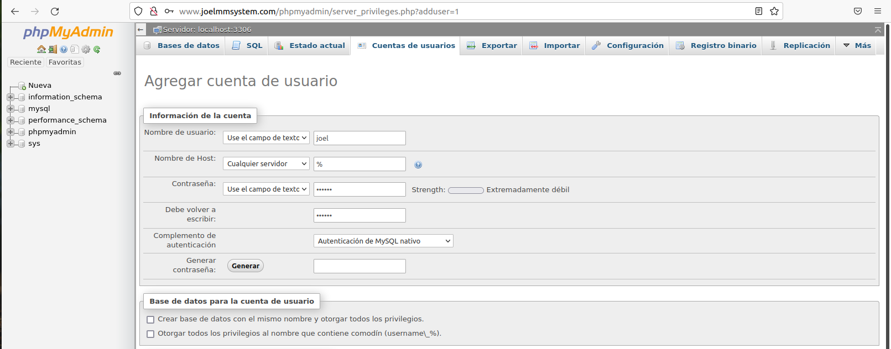

El resultado es el siguiente

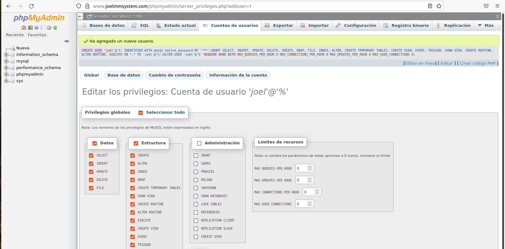

Como vemos en cuentas de usuario, podemos localizar al usuario nuevo creado

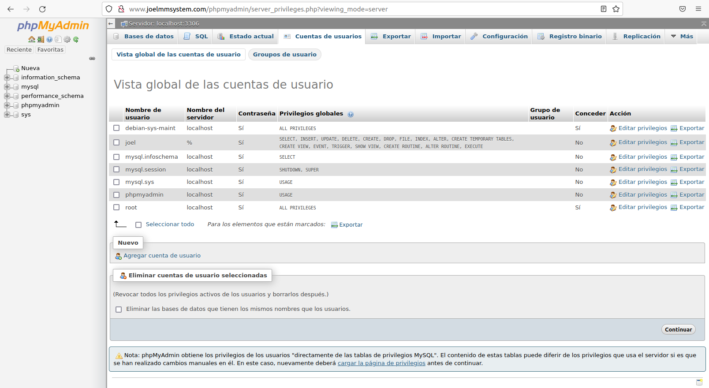

Ahora probamos a entrar con la nueva cuenta de usuario

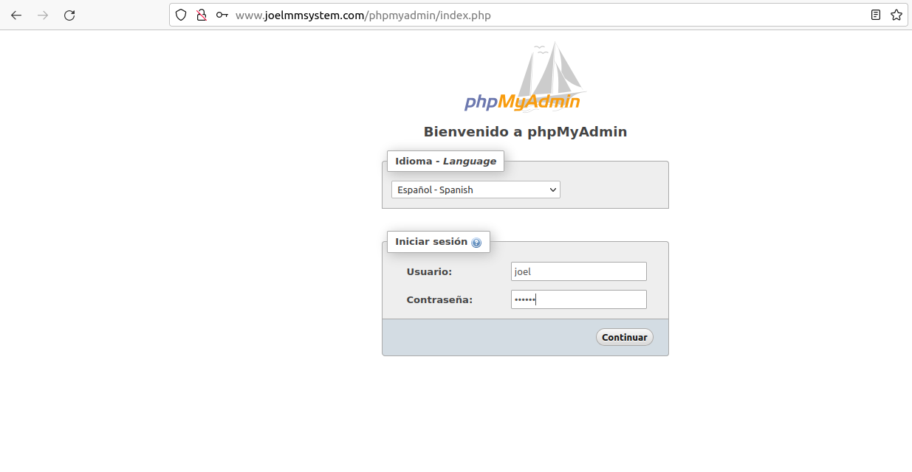

Vemos el correcto funcionamiento

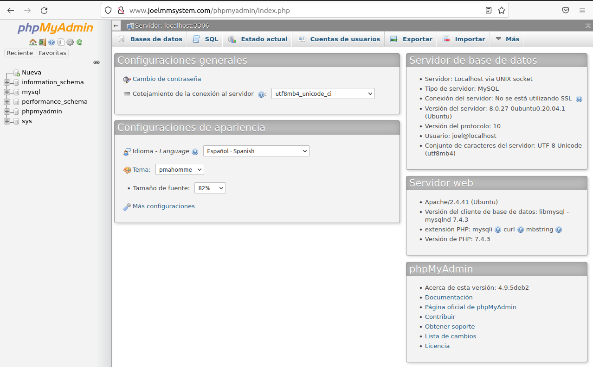

**7. Instalación y configuración de SFTP**

Actualizaremos los repositorios de ubuntu

> sudo apt update

Ahora procederemos a instalar SFTP con el comando...

> sudo apt install vsftpd

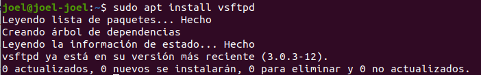

Nos crearemos un usuario con el comando...

> sudo adduser --shell /bin/false sftp

Intro en todas las opciones, dejando los campos vacíos

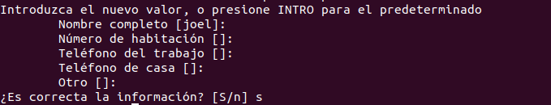

El usuario creado lo ponemos como propietario de la carpeta sftp de nuestro dominio con el siguiente comando

> sudo chown sftp:sftp /var/www/joelmmsystem/subdomine

Ponemos la carpeta de ese usuario como home con el siguiente comando 

Buscamos el fichero vsftpd.conf y accedemos al archivo con los comandos....

> locate vsftpd.conf  
> sudo nano .....

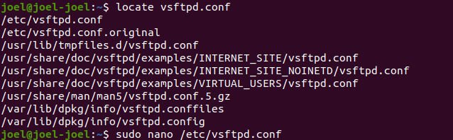

Cambiamos la linea *pam_service_name* poniendo como resultado *ftp* como se muestra en la imagen

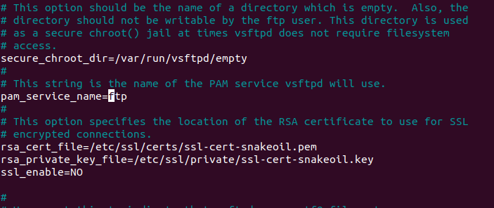

Seleccionamos los permisos para el directorio 

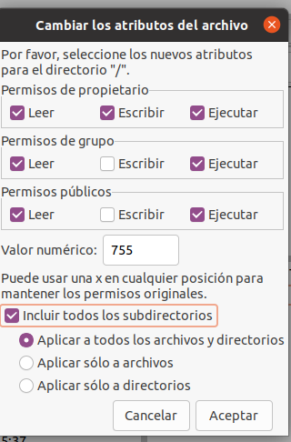

Nos conectaremos con nuestro localhost, usuario y contraseña

Subiremos un fichero para comprobar la transferencia de archivos 

Se ha subido el archivo

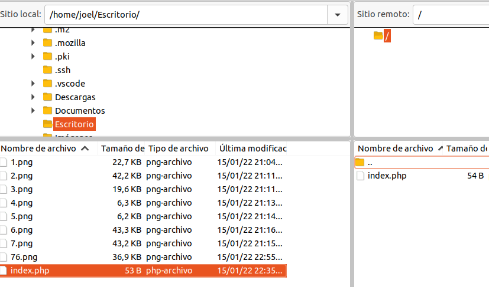

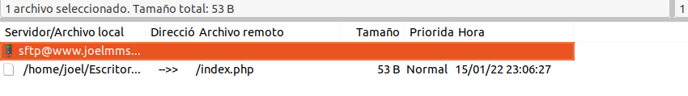

Verificamos en nuestro subdominio que se a subido correctamente

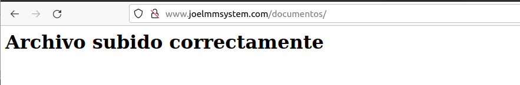

Enlace github: <a href="https://github.com/joel92MM/Git/tree/main/2ºTrimestre/ConstruccionServicioEmpresa">enlace</a>
