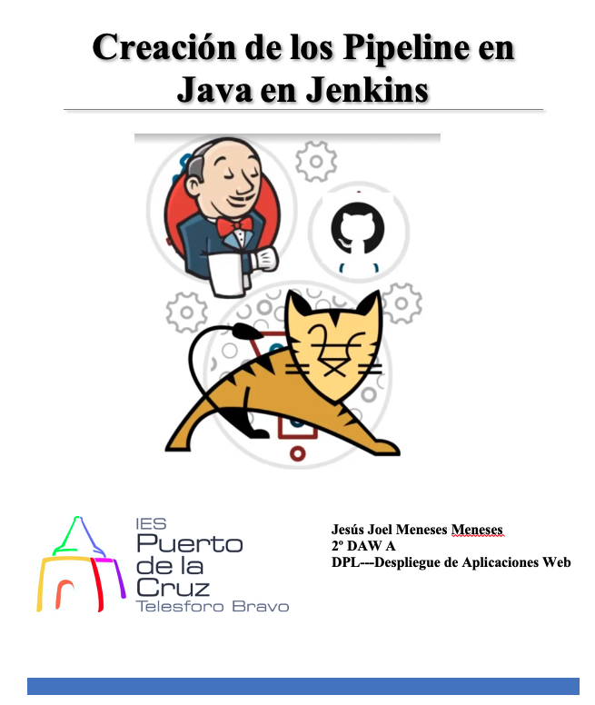

# Índice #

## 1. Requisitos básicos ##

## 2. Creacion de repositorio ##

## 3. Ficheros de configuración ##

## 4. Creación pipeline en java ##

**1. Requisitos básicos**

- 
Tener jenkins instalado

- 
Haber realizado el ejercicio del siguiente <a href="https://github.com/jpexposito/docencia/blob/master/DPL/ARQUITECTURAS/tareas/despliegue-jsp-apache-tomcat.md">enlace</a>

**2. Creación de repositorios**

Creamos el repositorio

Paramos todos los contenedores de docker

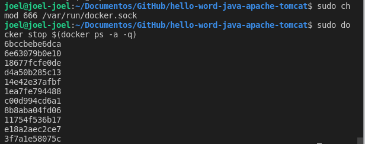

Clonamos el proyecto del siguiente [enlace](https://github.com/jpexposito/docencia/blob/master/DPL/ARQUITECTURAS/tareas/despliegue-jsp-apache-tomcat.md).

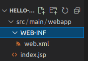

**3. Ficheros de configuración**

Creamos nuestro DockerFile, con la siguiente estructura...

>  FROM tomcat:version-seleccionada

>  LABEL maintainer="emailalumno@iespuerto.es"

>  ARG WAR_FILE=target/*.war

>  ADD ${WAR_FILE} /usr/local/tomcat/webapps/

>  EXPOSE 8082

>  CMD ["catalina.sh", "run"]</pre>

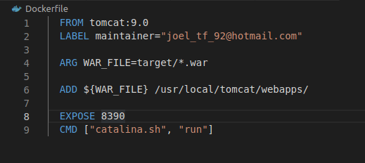

Creamos el fichero Jenkinsfile, con el siguiente contenido...

- State Test Junit. Debe de ejecutar el comando:

>  mvn clean test

- State Build. Debe de ejecutar el comando:

>  mvn clean package

- State Deploy. Debe de ejecutar el comando:

>  Sentencias Docker

- Test Integration. Debe de ejecutar el comando:

>  Verificar que la aplicación esta desplegada a través de un  (wget -m http://www.example.com).

> Verificar que el fichero descargado contiene el nombre del alumno.
 https://ubunlog.com/buscar-cadenas-o-patrones-texto-sin-formato/

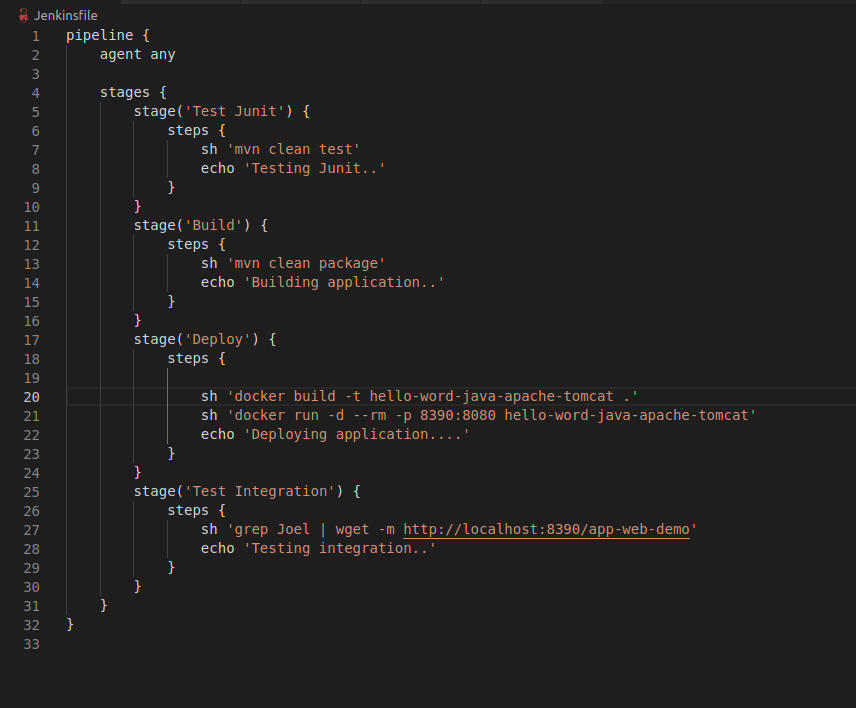

Creamos el target, con el siguiente comando

> mvn clean install

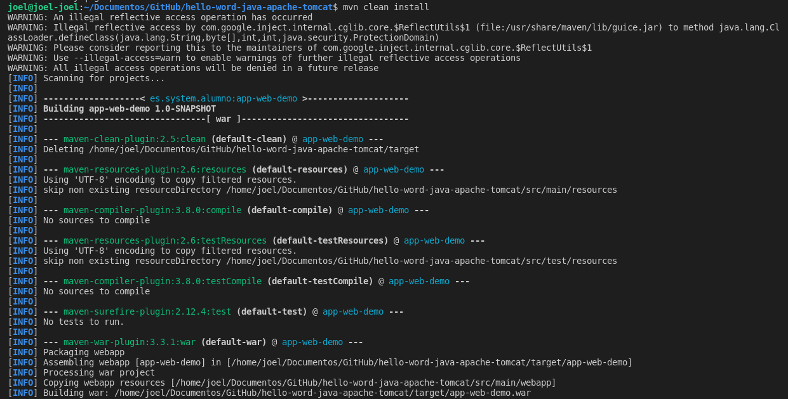

Quedaria una estructura similar a la siguiente 

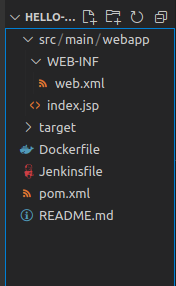

Subimos el proyecto a nuestro GitHub

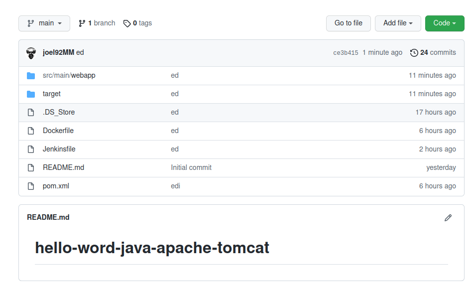

**4. Creación pipeline en java**

En el Jenkis nos creamos una nueva tarea pipeline nueva

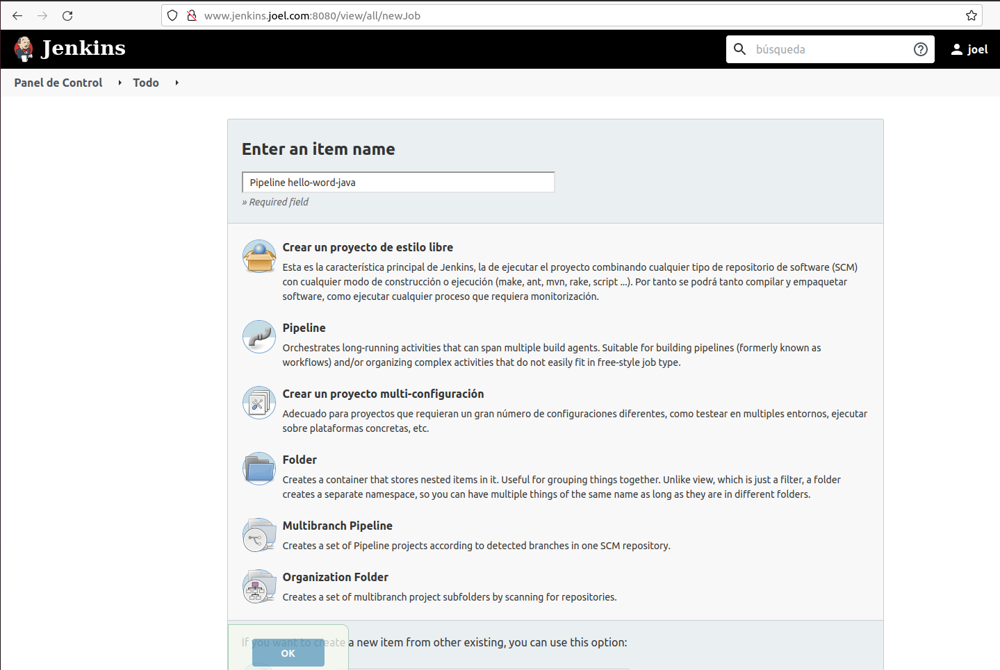

Luego le indicamos nuestro repositorio Git con las credenciales

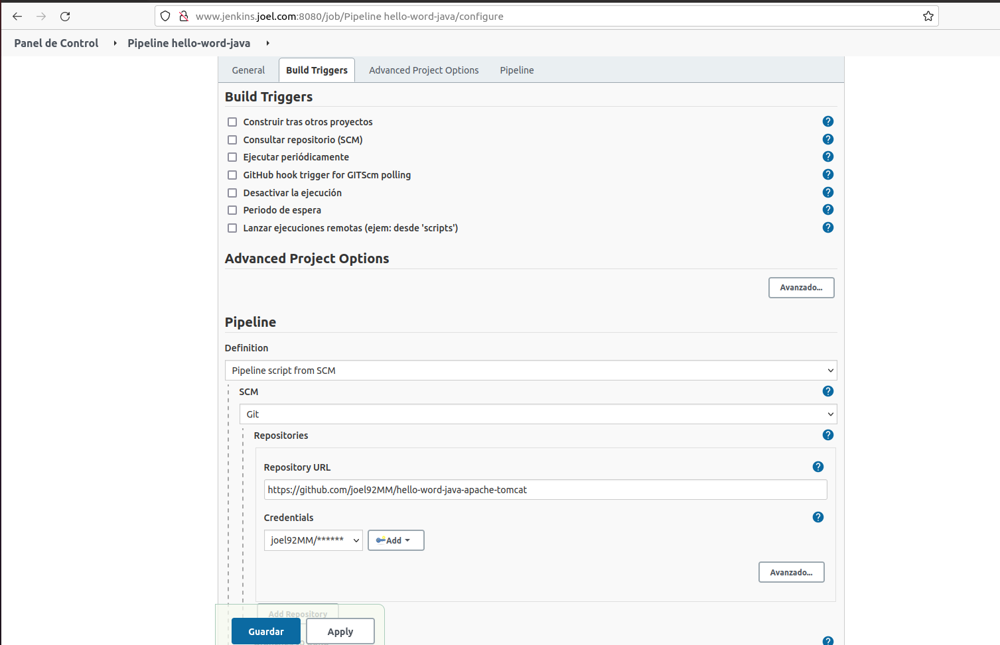

 
 
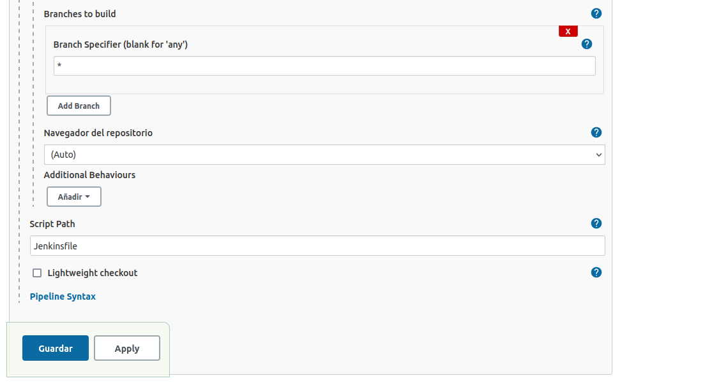

Vemos el pipeline creado, lo ejecutamos

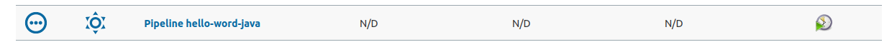

Vemos el proceso de construcción

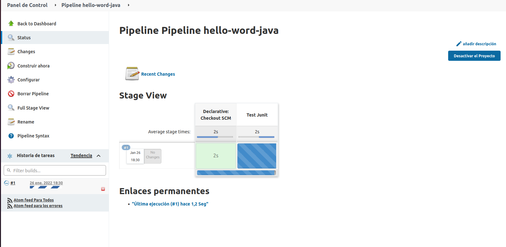

Si nos da el siguiente mensaje de error

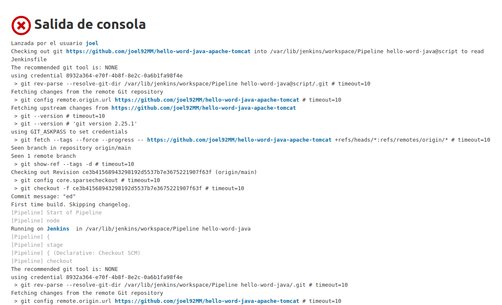

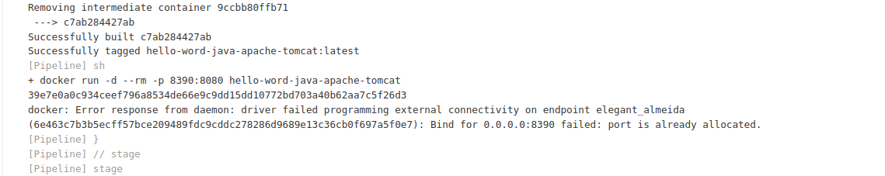

Nos iremos a la terminal y vemos los puertos ocupados

Vemos el contenedor que esta ocupando ese puerto 

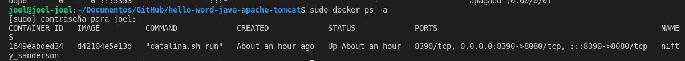

Luego paramos el contenedor

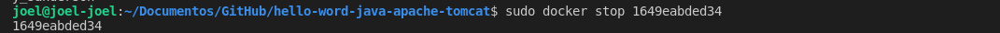

Volvemos a ejecutar el pipeline, y finalmente se ejecuta

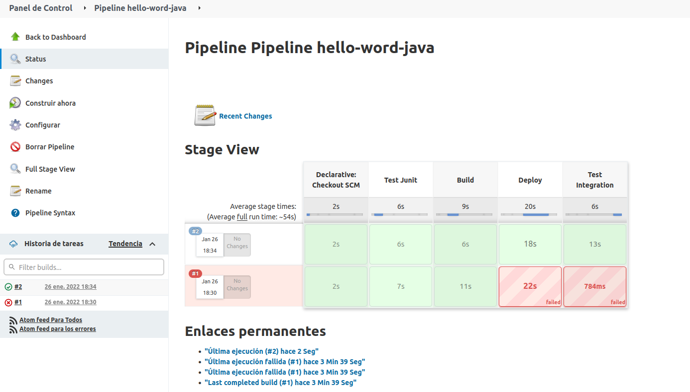

La salida por consola es correcta

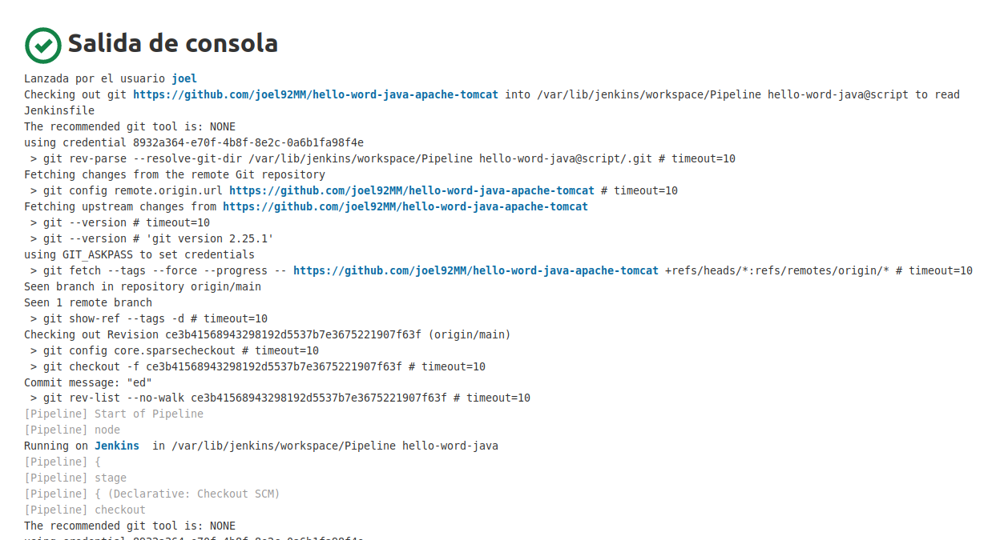

Si mostramos la direccion en el navegador, se mostraria el resultado siguiente

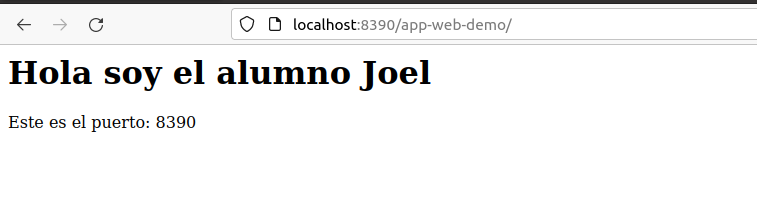

Enlace github: <a href="https://github.com/joel92MM/Git/tree/main/2ºTrimestre/CreacionPipelineJava">enlace</a>
