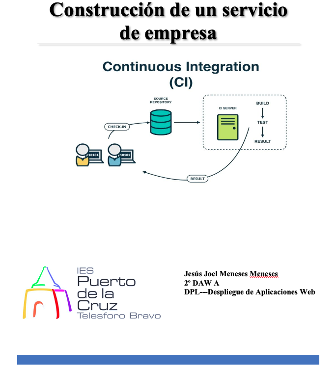

# Índice #

## 1. Creación del dominio principal ##

## 2. Creación del subdominio sftp##

## 3. Creación del subdominio despliegue##

## 4. Verificación de SFTP en cliente subdominio despliegue##

## 5. Creación del subdominio jenkins##

## 6. Creación del subdominio phpmyadmin ##

## 7. Creación de pipeline ##

**1. Creación de dominio principal**

Crearemos el fichero de configuración para trabajar con el host virtual, el contenido es el siguiente:

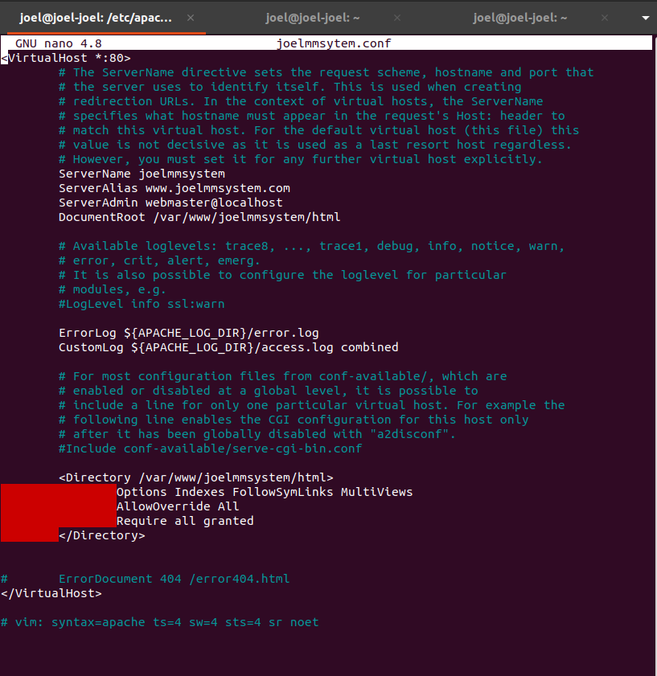

 
 

Una vez creado el fichero de configuración crearemos un enlace simbólico desde el archivo de configuración al directorio sites-enabled, con el comando:

> sudo a2ensite nombreFicheroConfiguracion

Comprobamos que no hay errores de sintaxis con el siguiente comando:

> sudo apachectl configtest

Seguidamente crearemos la estructura de directorios en /var/www/

Creamos la carpeta raiz del dominio

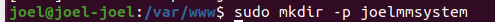

 
 
Crearemos el contenido de la pagina del dominio principal, index.php el cual sera el siguiente:

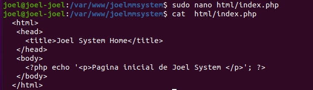
 
 

Luego personalizamos el error404 con la siguiente configuración

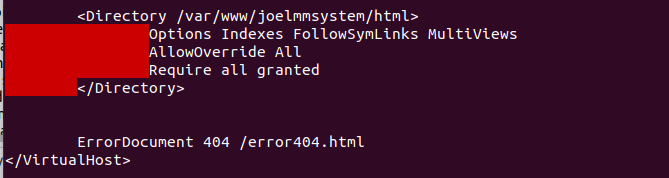

A continuación crearemos el nombre de la url que aparecerá en el navegador

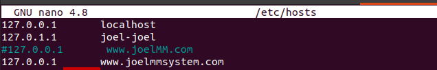

 
 

Si todo ha ido bien reiniciamos el servicio apache2 con el siguiente comando:

> sudo systemctl restart apache2

Visualización del contenido en un navegador web

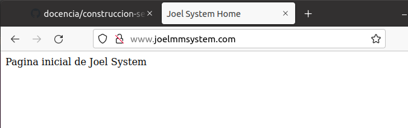

 
 

Si introducimos una dirección errónea aparecerá esta imagen

 
 

**2. Creación de subdominio SFTP**

Crearemos el fichero de configuración para trabajar con el host virtual, el contenido es el siguiente:

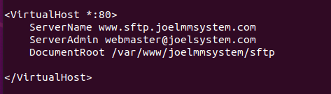

Comprobamos que no hay errores de sintaxis con el siguiente comando:

> sudo apachectl configtest

Creamos la carpeta del subdominio

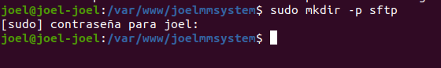

Crearemos el nombre de url del subdominio

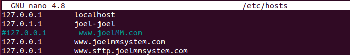

Visualización el correcto funcionamiento del nombre de host en una navegador

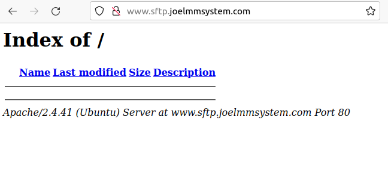

**3. Creación de subdominio despliegue**

Crearemos el fichero de configuración para trabajar con el host virtual, el contenido es el siguiente:

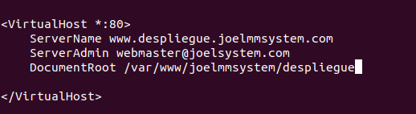

Comprobamos que no hay errores de sintaxis con el siguiente comando:

> sudo apachectl configtest

Creamos la carpeta del subdominio

Crearemos el nombre de url del subdominio

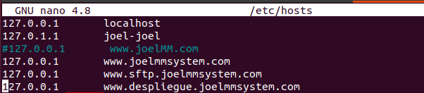

Visualización el correcto funcionamiento del nombre de host en una navegador

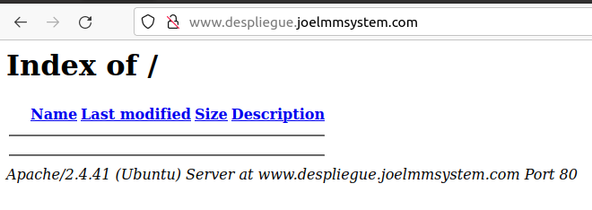

**4. Verificación de SFTP en cliente subdominio despliegue**

Ahora nos crearemos el usuario despliegues con el comandos

> sudo adduser --shell /bin/false nombreUsuario

> contraseña-> 123456789

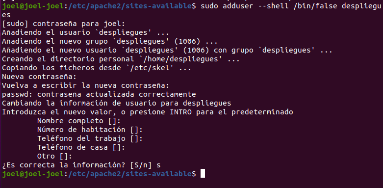

Al usuario lo asignamos como propietario de la carpeta despliegue de nuestro dominio con el siguiente comando

> sudo chown usuario:carpeta /var/www/joelmmsystem/nombrecarpeta

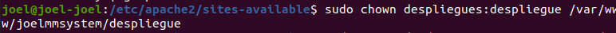

Ponemos la carpeta de ese usuario como home con el siguiente comando:

> sudo usermod -d /var/www/joelmmsystem/nombrecarpeta usuarioftp

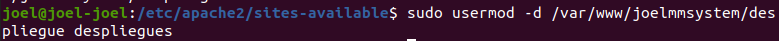

Luego mediante un cliente Filezilla accedemos al servidor www.sftp.joelmmsystem.com, el usuario y contraseña que hemos creado de sftp

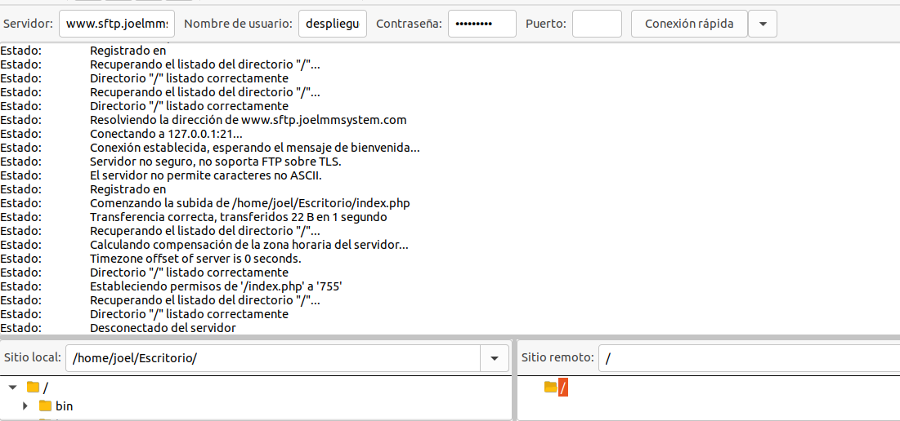

Vemos que se ha establecido conexión

Seguidamente asignaremos los permisos necesarios para ver los archivos subidos

Subimos un archivo de ejemplo, y vemos como se ha subido correctamente

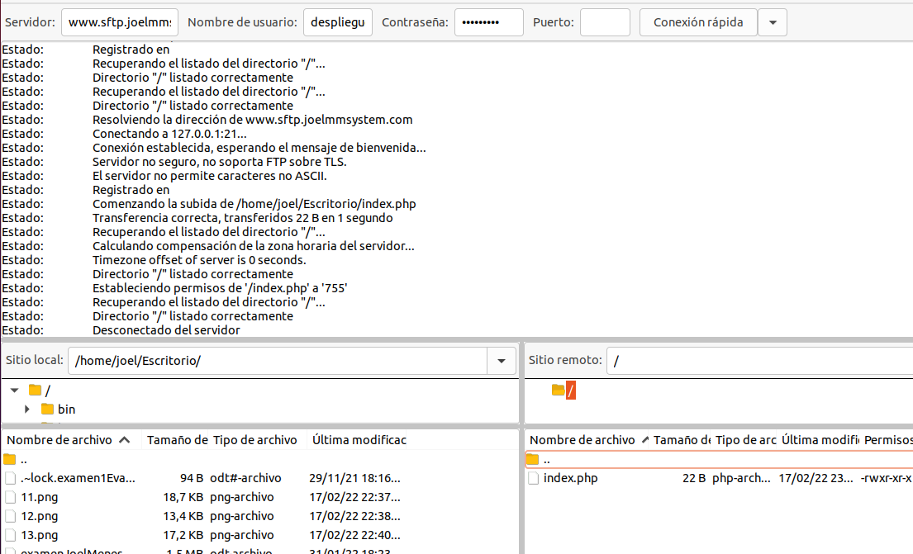

El el navegador mediante el subdominio www.despliegue.joelmmsystem.com veremos el archivo index.php

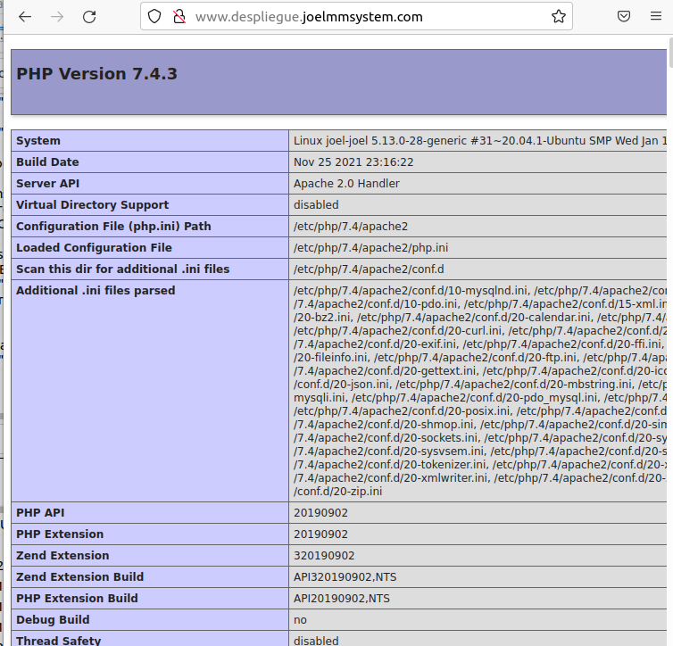

**5. Creación de subdominio Jenkins**

Crearemos el fichero de configuración para trabajar con el host virtual, el contenido es el siguiente:

Redireccionamos la url de jenkins al subdominio que estamos creando, el 301 indica enlace permanente

Comprobamos que no hay errores de sintaxis con el siguiente comando:

> sudo apachectl configtest

Crearemos el nombre de url del subdominio

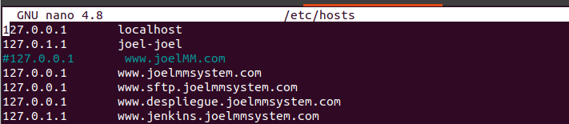

Visualizamos en el navegador que entramos en jenkins correctamente

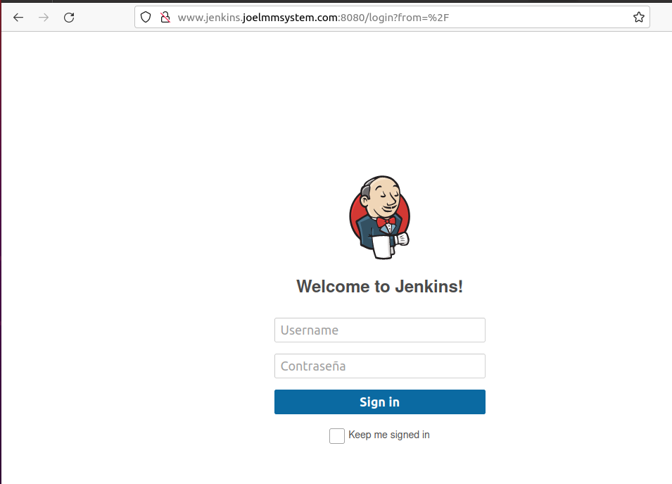

**6. Creación de subdominio phpmyadmin**

Crearemos el fichero de configuración para trabajar con el host virtual, el contenido es el siguiente:

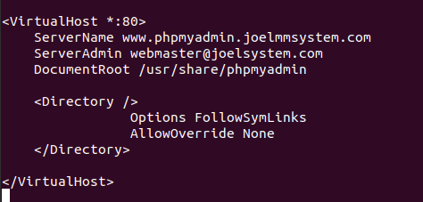

Comprobamos que no hay errores de sintaxis con el siguiente comando:

> sudo apachectl configtest

Crearemos el nombre de url del subdominio

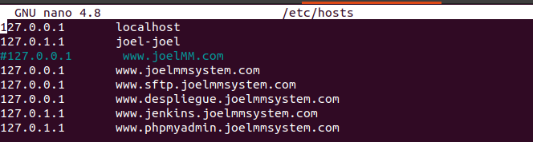

Visualizamos en el navegador que entramos en phpmyadmin correctamente

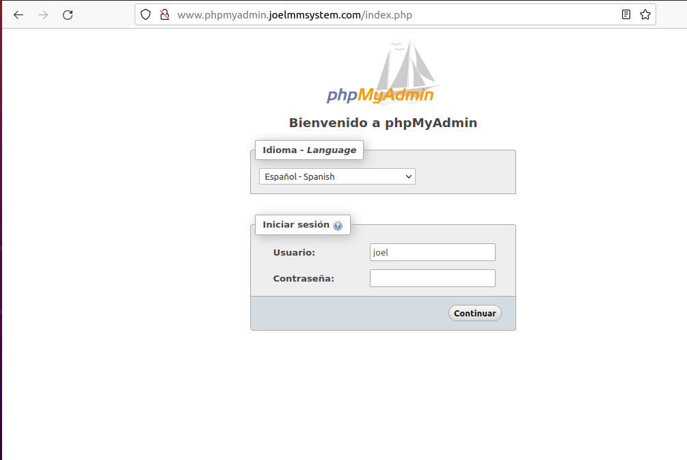

Nos logeamos con el usuario creado en esta [tarea](https://github.com/joel92MM/Git/tree/main/2%C2%BATrimestre/ConstruccionServicioEmpresa)

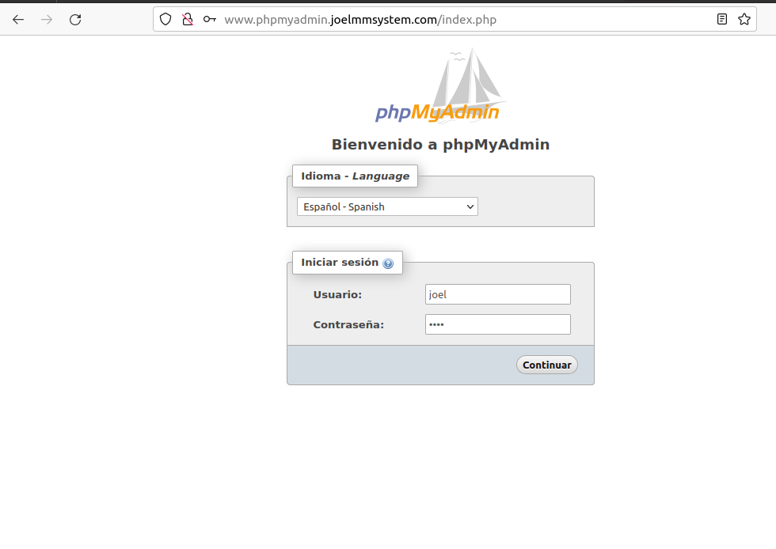

Vemos que hemos entrado en phpmyadmin con el usuario

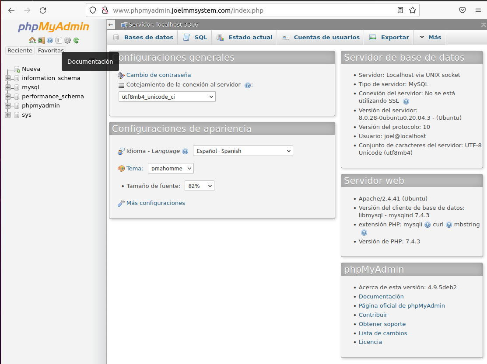

**6. Creación de pipeline**

Entramos en Jenkins mediante el subdominio anteriormente creado

Creamos una tarea pipeline nueva, con el nombre que aparece en la imagen

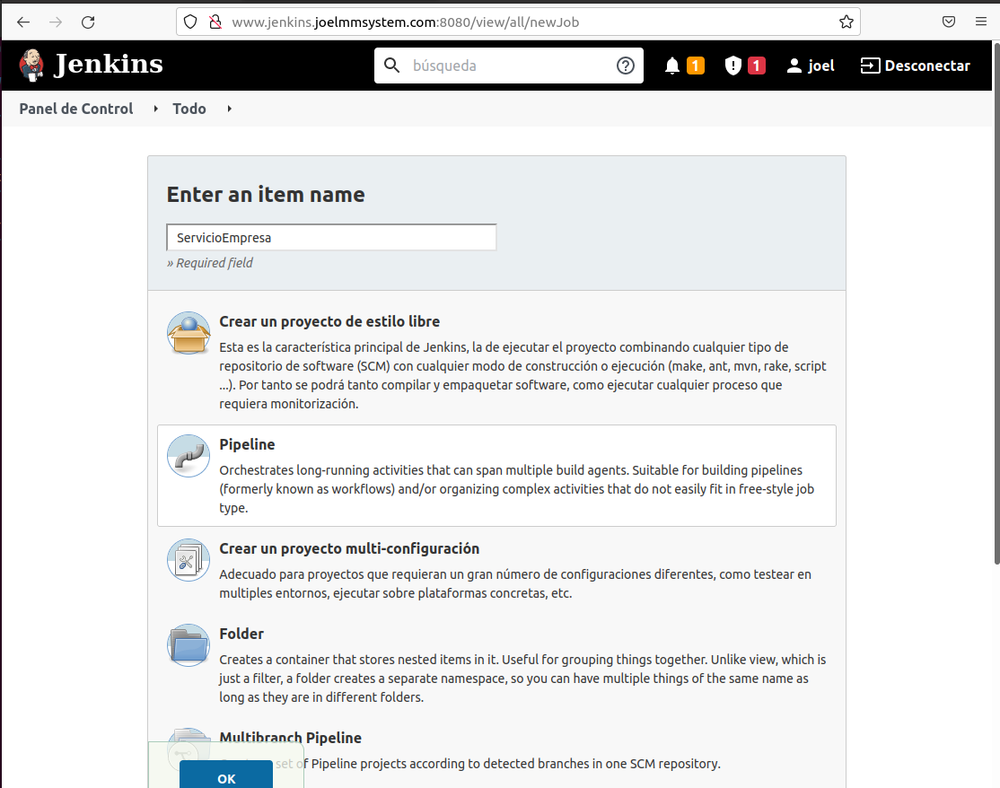

 
 

A continuación nos mostrará la ventana de configuración de la pipeline, iremos a la opción Pipeline y en el script copiamos el contenido de la imagen

 
 

- El comando de la linea 6 nos permitirá subir el fichero index.php al subdominio sftp.joelmmsystem.com, que se verá en despliegue.joelmmsystem.com

- El comando de la linea 11 nos mostrará la versión instalada en local de MYSQL

- El comando de la linea 12 nos mostrará si la frase que queremos buscar con el comando grep se encuentra en la página solicitada.

- El comando de la linea 13 nos mostrará si la frase que queremos buscar con el comando grep se encuentra en la página solicitada.

- El comando de la linea 14 nos mostrará si la frase que queremos buscar con el comando grep se encuentra en la página solicitada.

Nos muestra la pipeline creada y configurada en el panel de control de Jenkins

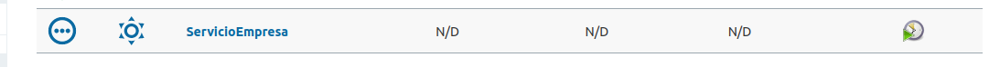

 
 

Construimos la pipeline

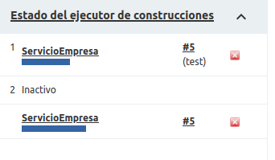

 
 

Nos muestra un error en la salida, vemos el error en los log

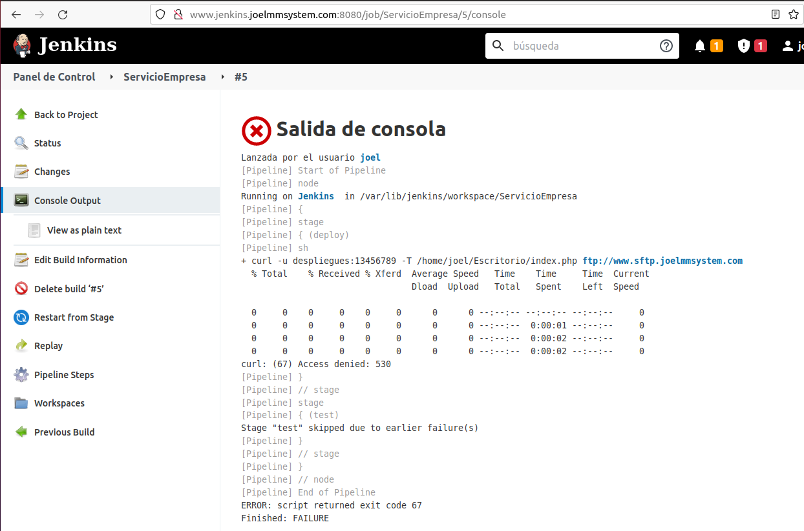

 
 

Consulto el error, y encuentro el error en está [página](https://stackoverflow.com/questions/12320219/curl-how-to-pass-password-containing-a-percent-sign) al parecer es un error de contraseña, arreglo ese error y vuelvo a construir la Pipeline, y se ha corregido el error, mostrándose correcta

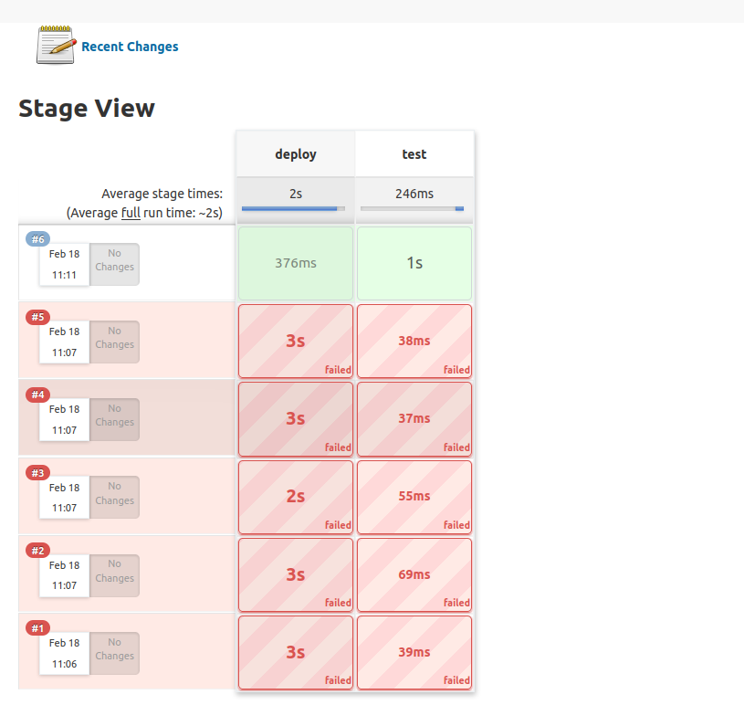

 
 

En el panel de control de jenkins vemos la pipeline que se ha ejecutado sin errores después de varios intentos

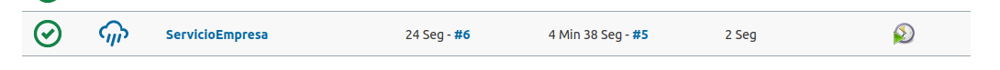

 
 

Verificamos en los log que se han ejecutado bien los comandos del script

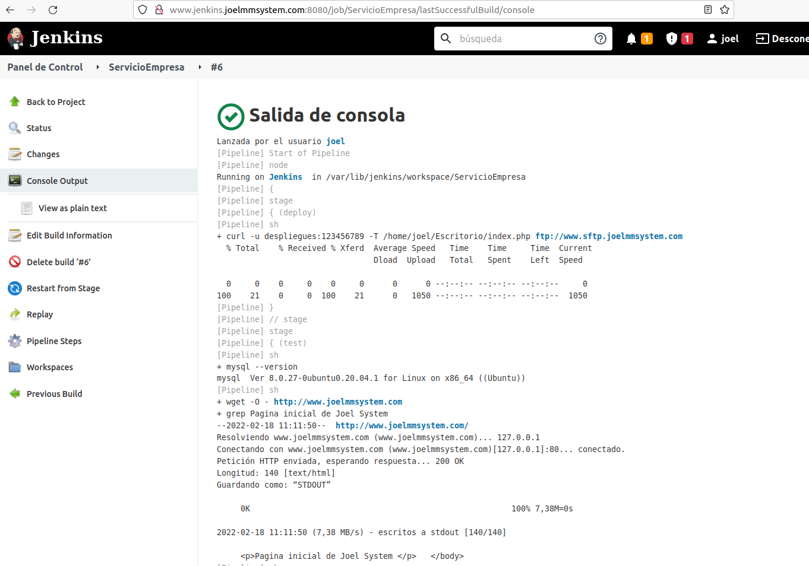

 
 

Enlace github: <a href="https://github.com/joel92MM/Git/tree/main/2ºTrimestre/ExamenConstruccionServicioEmpresa">enlace</a>
