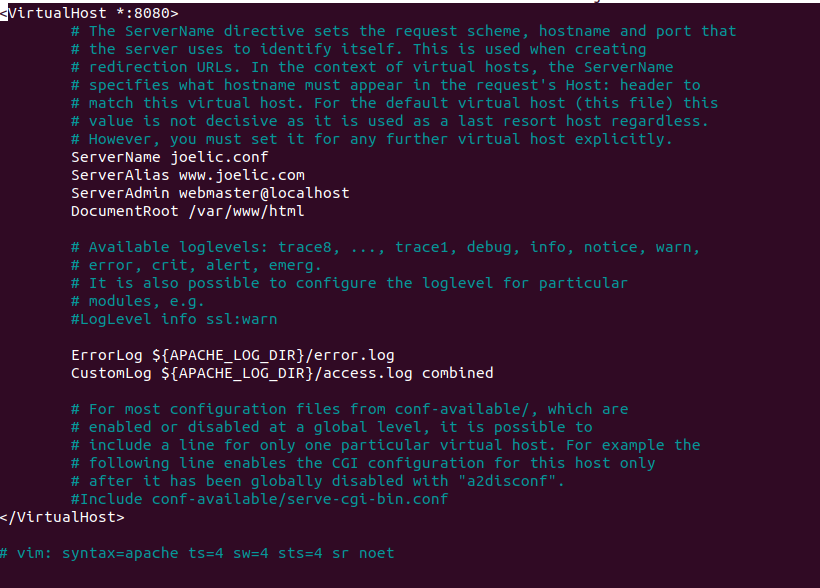
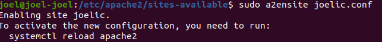
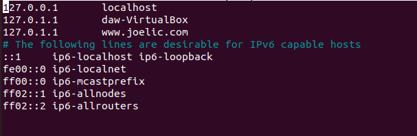
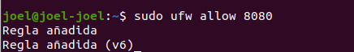
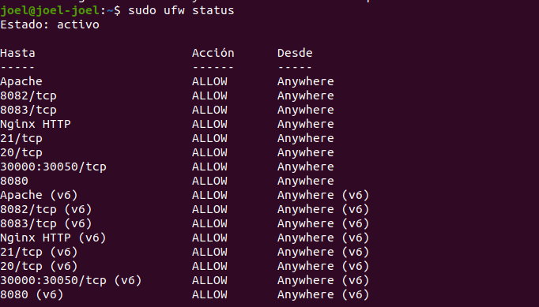
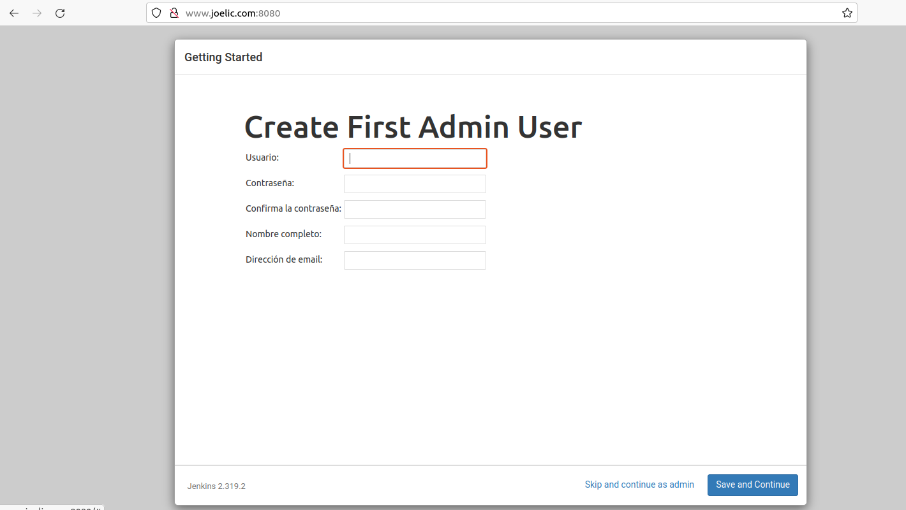
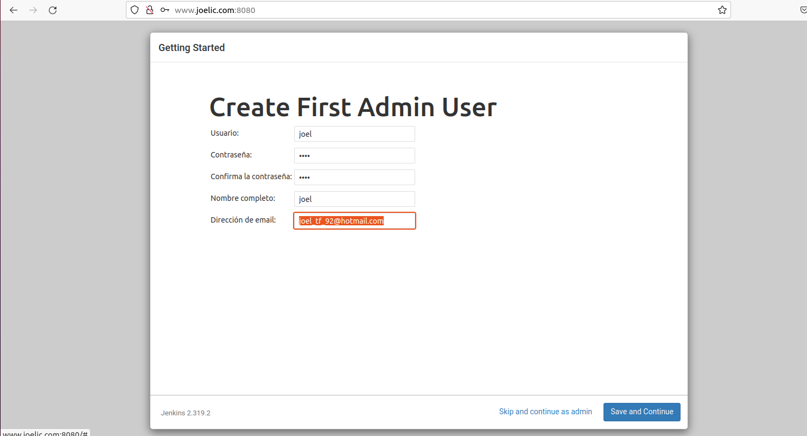

# Índice #

## 1. Requisitos básicos ##

## 2. Creación del dominio ##

## 3. Instalar Jenkins ##

## 4. Iniciar Jenkins ##

## 5. Abrir el Firewall ##

## 6. Configurar Jenkins ##

**1. Requisitos básicos**

- Disponer de una máquina Ubuntu 20.04
- Internet
- Open JDK 11

**2. Creación del dominio**

Nos situamos en la carpeta de apache sites-available

Copiamos la carpeta de original apache y creamos una nueva 

Configuramos la carpeta nueva

Habilitamos el sitio

Reiniciamos apache

Añadimos el dominio en /etc/hosts

**3. Instalar Jenkins**

Primero, agregamos la clave del repositorio al sistema:

Unaa vez agregada la clave, el sistema devolvera como resultado ok

>   wget -q -O - https://pkg.jenkins.io/debian-stable/jenkins.io.key | sudo apt-key add

A continuación, vamos a anexar la dirección del repositorio de paquetes de Debian a sources.list del servidor:

>  sudo sh -c 'echo deb http://pkg.jenkins.io/debian-stable binary/ > /etc/apt/sources.list.d/jenkins.list'

Una vez que se hayan ingresado ambos comandos, ejecutaremos update de manera que apt utilice el nuevo repositorio. REALIZA ESTE PASO SÓLO SI HAY MUCHO TIEMPO QUE NO ACTUALIZAS EL SISTEMA, O TIENES PROBLEMAS EN EL SIGUIENTE PASO.

> sudo apt update

Ahora instalaremos Jenkis y sus dependencias, con el comando 

> sudo apt install Jenkins

Posteriormente iniciamos el servidor de Jenkins

**4 . Iniciar Jenkins**

Iniciamos Jenkins con el siguiente comando...

> sudo systemctl start jenkins

Verificamos que Jenkis se haya iniciado correctamente con el comando..

> sudo systemctl status jenkins

Resultado 

**5 . Abrir el Firewall**

Configuramos el Firewall UFW, con el comando...

> sudo ufw allow 8080

Si esta desactivado ejecutaremos los siguientes comandos..

> sudo ufw allow OpenSSH 
> sudo ufw enable

Compruebe el estado de ufw para confirmar las nuevas reglas, con el comando

> sudo ufw status

Resultado

**6. Configurar Jenkins**

En el navegador insertamos nuestro dominio y puerto para configurar Jenkins, deberia ver una imagen como la siguiente..

Para mostrar la contraseña utilizaremos el siguiente comando..

> sudo cat /var/lib/jenkins/secrets/initialAdminPassword

Copiamos la contraseña alfanumérica de 32 caracteres de la terminal, la pegamos y luego clickeamos en Continue.

Haremos clic en la opción Install suggested plugins (Instalar los complementos sugeridos), que iniciará de inmediato el proceso de instalación.

Espereamos que se complete el proceso de instalación

En la siguiente ventana configuramos el usuario administrador

Introduciendo nuestra informacion 

Confirmamos la url para instanciar Jenkis

Finalizado el proceso de congifuracion se mostrara una ventan similar a la siguiente 

Clickeamos en *Start using Jenkins* donde nos mostrara el panel de Jenkins

Enlace github: <a href="https://github.com/joel92MM/Git/tree/main/2ºTrimestre/InstalacionConfiguracionJenkinsLinux">enlace</a>
