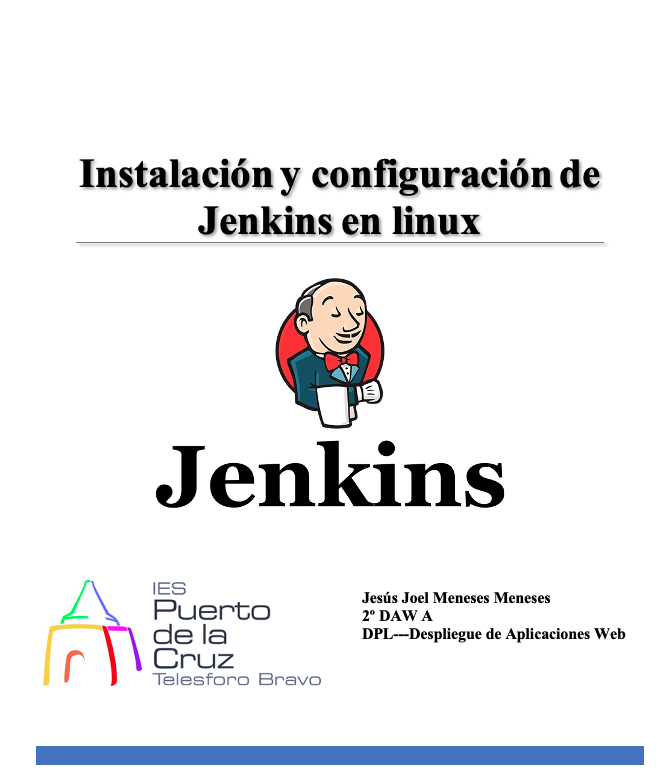
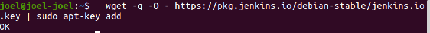
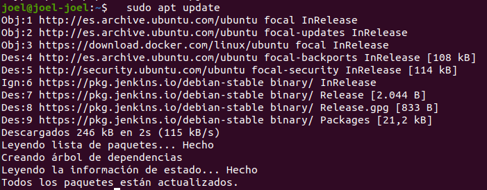
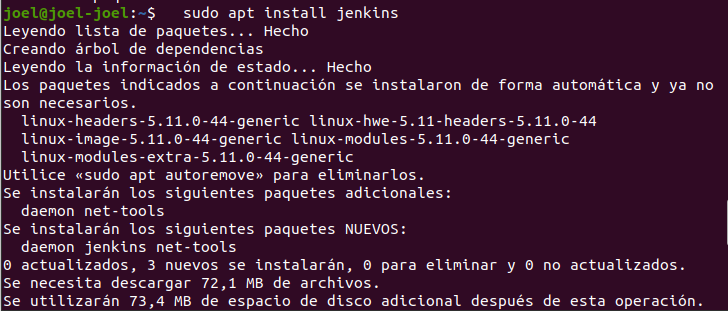
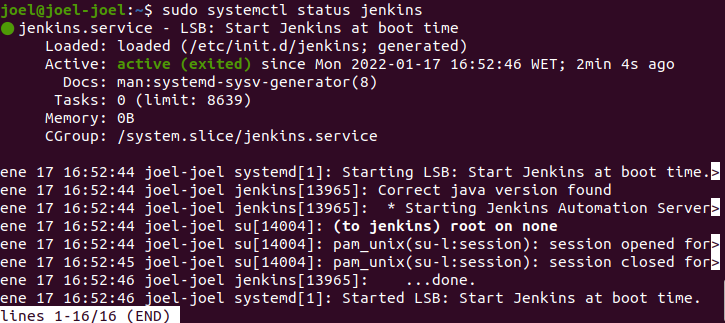

# Índice #

## 1. Requisitos básicos ##

## 2. Creación del dominio ##

## 3. Instalar Jenkins ##

## 4. Iniciar Jenkins ##

## 5. Abrir el Firewall ##

## 6. Configurar Jenkins ##

**1. Requisitos básicos**

- Disponer de una máquina Ubuntu 20.04
- Internet
- Open JDK 11

**2. Creación del dominio**

Nos situamos en la carpeta de apache sites-available

Copiamos la carpeta de original apache y creamos una nueva 

Configuramos la carpeta nueva

Habilitamos el sitio

Reiniciamos apache

**3. Instalar Jenkins**

Primero, agregamos la clave del repositorio al sistema:

Unaa vez agregada la clave, el sistema devolvera como resultado ok

>   wget -q -O - https://pkg.jenkins.io/debian-stable/jenkins.io.key | sudo apt-key add

A continuación, vamos a anexar la dirección del repositorio de paquetes de Debian a sources.list del servidor:

>  sudo sh -c 'echo deb http://pkg.jenkins.io/debian-stable binary/ > /etc/apt/sources.list.d/jenkins.list'

Una vez que se hayan ingresado ambos comandos, ejecutaremos update de manera que apt utilice el nuevo repositorio. REALIZA ESTE PASO SÓLO SI HAY MUCHO TIEMPO QUE NO ACTUALIZAS EL SISTEMA, O TIENES PROBLEMAS EN EL SIGUIENTE PASO.

> sudo apt update

Ahora instalaremos Jenkis y sus dependencias, con el comando 

> sudo apt install Jenkins

Posteriormente iniciamos el servidor de Jenkins

**4 . Iniciar Jenkins**

Iniciamos Jenkins con el siguiente comando...

> sudo systemctl start jenkins

Verificamos que Jenkis se haya iniciado correctamente con el comando..

> sudo systemctl status jenkins

Resultado 

**5 . Abrir el Firewall**

Configuraos el Firewall UFW, con el comando...

Si esta desactivado ejecutaremos los siguientes comandos..

> sudo ufw allow OpenSSH
> sudo ufw enable

