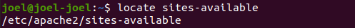
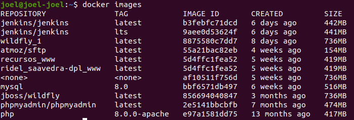
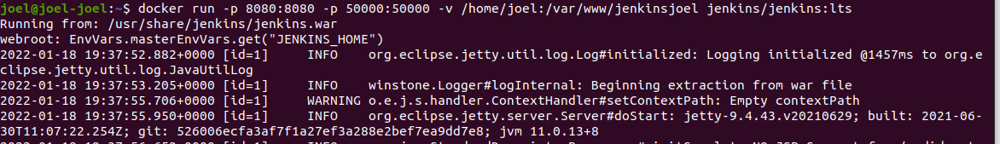
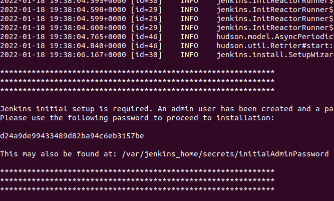
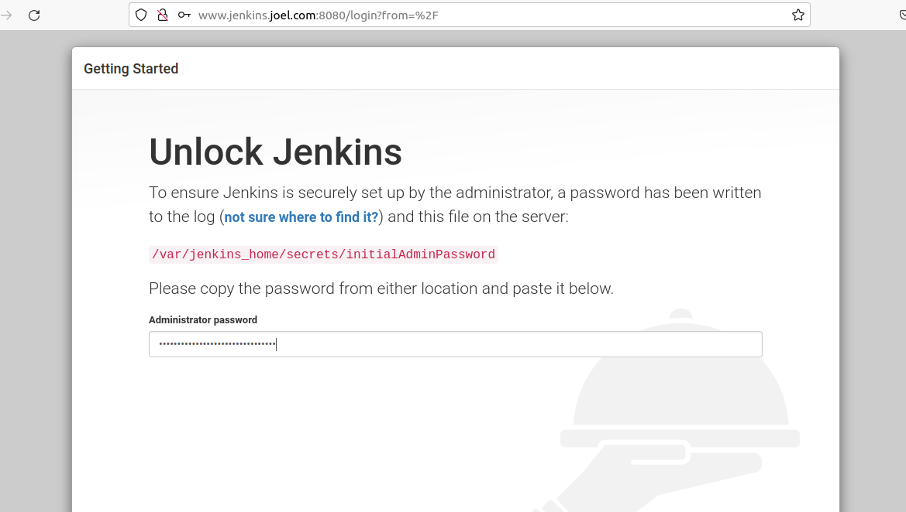
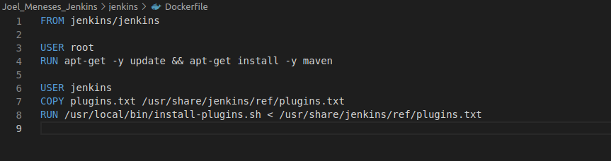
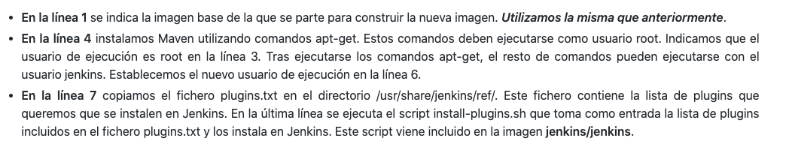
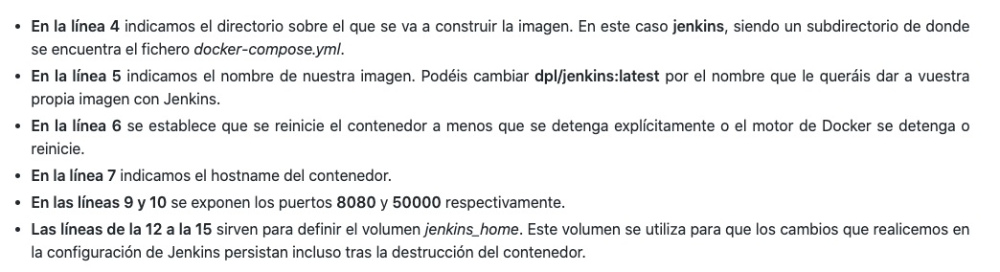
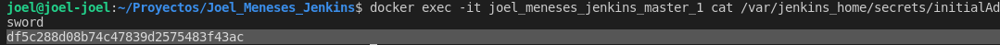

# Índice #

## 1. Requisitos básicos ##

## 2. Creación del dominio ##

## 3. Instalación de  Jenkins en Docker ##

## 4. Instalación de Jenkins a través de Docker y Docker-Compose ##

- ### 4.1 Dockerfile ###
- ### 4.2 Plugins.txt ###
- ### 4.3 Docker-Compose###
- ### 4.4 Construcción de la imagen###

**1. Requisitos básicos**

- 
Tener docker instalado

- 
Tener docker-compose instalado

**2. Creación del dominio**

Nos situamos en la carpeta de apache sites-available

Copiamos la carpeta de la practica anterior *joelic.conf* y en su lugar creamos jekins.joel.conf

Configuramos la carpeta nueva

Habilitamos el sitio

Reiniciamos apache

Añadimos el dominio en /etc/hosts

**3. Instalación de Jenkins en Docker**

<Antes de esto eliminamos todos contenedores,imagenes y volumnes en docker>

Nos dirigimos a <a href="">https://hub.docker.com/</a> y buscamos la imagen oficial de jenkins 

Descargamos la imagen de jenkins para docker con el siguiente comando...

>  docker pull jenkins/jenkins:lts

Verificamos que la imagen se ha descargado corrrectamente con el siguiente comando...

>  docker images

Ahora ejecutamos jenkins como contenedor Docker exponiendolo en el puerto 8080 del ordenador local. Verificamos nuestro /your/home:/ con el comando 

> docker run -p 8080:8080 -p 50000:50000 -v /your/home:/var/jenkins_home jenkins/jenkins:lts

Si nos muestra el mensaje de error anterior hacemos lo siguiente

Listamos los puertos activos y vemos quien los esta ocupando con el siguiente comando de la imagen y luego eliminamos el servicio de ese puerto 

Volvemos a lanzar el comando anterior

Se genera una contraseña que debemos copiar

Verifica que puedas ingresar al contenedor a través del navegador web de tu preferencia.

Lo config

**4. Requisitos básicos**

Creamos una carpeta que va a tener los ficheros de configuración de jenkins

***4.1 Dockerfile***

Posteriormente nos creamos un fichero dockerfile con el contenido siguiente

Explicación del fichero dockerfile

***4.2 Plugins.txt***

Ahora creamos un fichero llamado plugins.txt que contienen los plugins a instalar en jekins, el contenido sera el siguiente

***4.3 Docker-Compose.yml***

Nos queda por crear nuestro docker-compose.yml con el contenido siguiente

Explicación del fichero docker-compose.yml

Creamos una carpeta llamada jenkins y metemos los ficheros dockerfile y pulgins.txt dentro de ella

Teniendo una estructura similar a la siguiente

***4.4 Construcción de la imagen***

Para construir la imagen ejecutamos el siguiente comando:

> docker-compose build

Para arrancar el contenedor con Jenkins ejecutamos el siguiente comando:

> docker-compose up -d

Arrancado jenkins accedemos a nuestro dominio para entrar en la consola jenkins

Para obtener la contraseña del usuario admin de Jenkins ejecutamos el siguiente comando:

> docker exec -it dockerjenkins_master_1 cat /var/jenkins_home/secrets/initialAdminPassword

Ahora podemos configurar jenkins en docker

Enlace github: <a href="https://github.com/joel92MM/Git/tree/main/2ºTrimestre/InstalacionConfiguracionJenkinsLinuxDocker">enlace</a>
