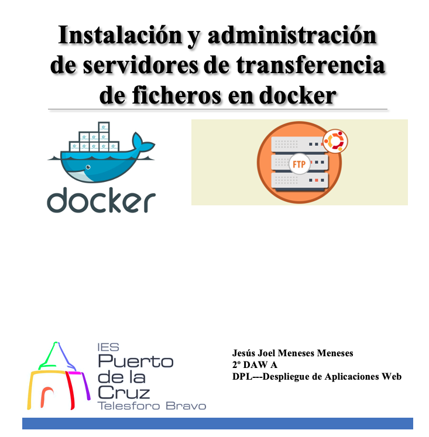

# Índice #

## 1. Requisitos básicos ##

## 2. Busquedas de imágenes creadas ##

## 3. Trabajar con la imagen atmoz  ##

## 4. Verificar la imagen ##

- ### 4.1 Configurar el directorio home en la máquina host ###

## 5. SFTP Multiusuario##

**1. Requisitos básicos**

- Disponer de una máquina Ubuntu 20.04
- Internet

**2. Búsquedas de imágenes creadas**

Podemos consultar las imágenes creadas para la instalación de SFTP, con el comando...

> docker search sftp

**3. Trabajar con la imagen atmoz**

Para utilizar la imagen desarrollada por <strong>atmoz</strong>, sobre <strong>ftp</strong> realizamos los siguientes pasos 

Ejecutamos la imagen, con el comando...

> docker run --name mysftp -p 2294:22 -d atmoz/sftp admin:admin:::upload

donde cada uno de los parámetros representa:

* name, nombre del contenedor mysftp
* admin: admin ::: upload donde foo es el nombre de usuario, pass es la contraseña, upload es el archivo cargado se guardará en el directorio / home / foo / upload en el contenedor. -p 22:22 asigna el puerto 22 del host al puerto 22 del contenedor, de modo que el puerto 22 del host de ubicación se reenviará al puerto 22 del contenedor. -d atmoz / sftp usa la imagen atmoz / sftp en el centro de acoplamiento para crear un contenedor.

**4. Verificar la imagen**

Para verificar la descarga imagen anterior, lanzamos el siguiente comando...

> sudo apt install -y vsftpd

Obtenemos un mensaje similar al siguiente

Podemos realizar la prueba de acceso al servidor FTP. Para ello podemos lanzar los siguientes comandos...

> sudo docker ps

***4.1 Instalando el paquete vsftpd***

Para realizar la confifuración del directorio de home de SFTP hemos de ejecutar el siguiente comando:

>   docker run --name mysftp2 -v /host/upload:/home/admin/upload --privileged=true -p 2295:22 -d atmoz/sftp admin:admin:1001

* v / host / upload: / home / admin / upload. Donde el frente de los dos puntos es el directorio del host, la parte posterior se monta en el directorio en el contenedor, si el directorio local / host / uplaod no existe, se creará automáticamente.

* --privileged = true. Debido a las reglas de seguridad de selinux de linux, es necesario agregar privilegios al contenedor.

* --name mysftp2. El nombre también se cambia. Debido a que el nombre no se puede repetir, el puerto también se repite, el contenedor no se iniciará.

## 5. SFTP Multiusuario ##

Enlace github: <a href="https://github.com/joel92MM/Git/tree/main/2ºTrimestre/Instalacion_Administracion_Servidores_Transferencia_Archivos_Docker">enlace</a>
