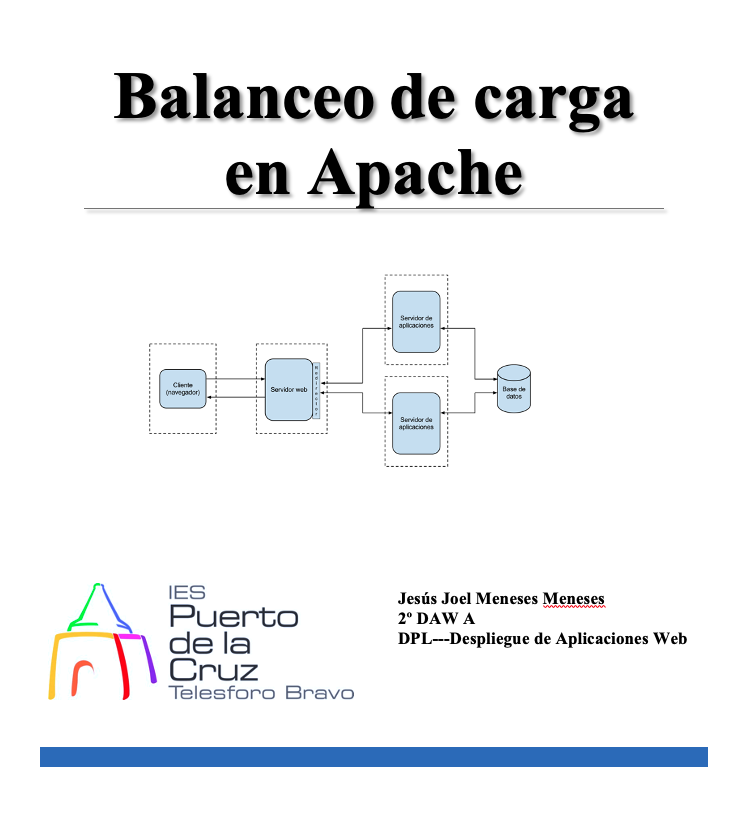
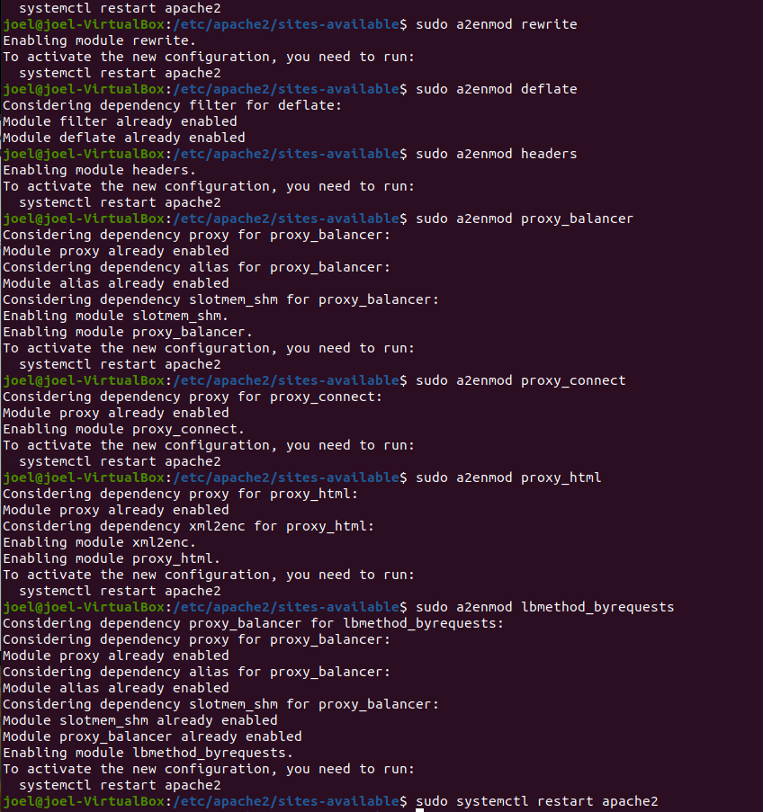
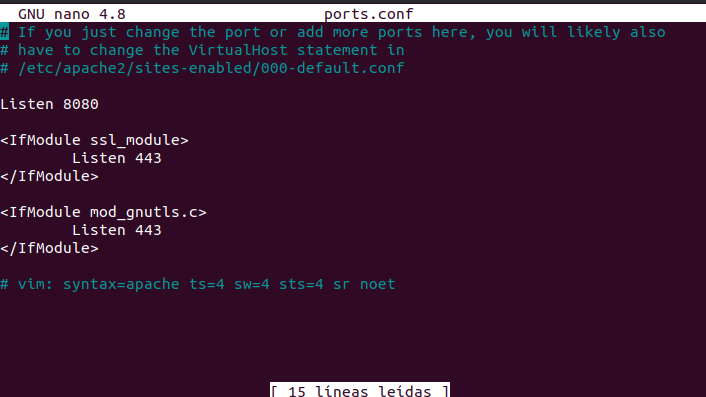
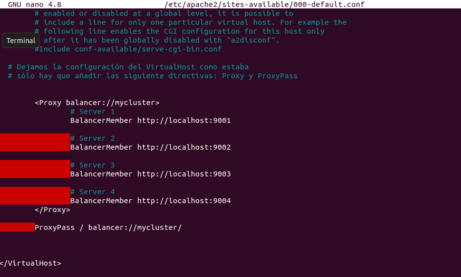
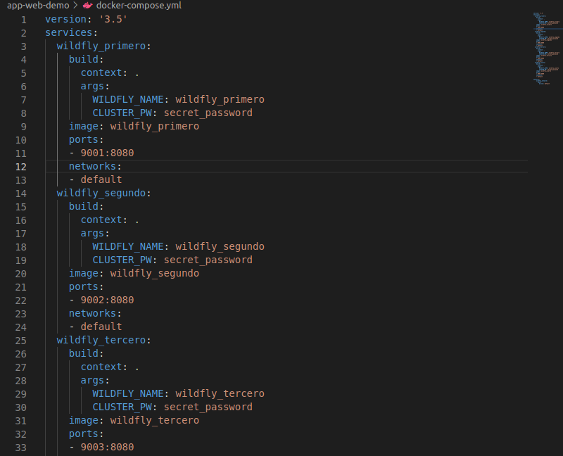
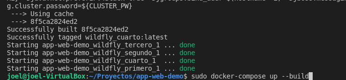
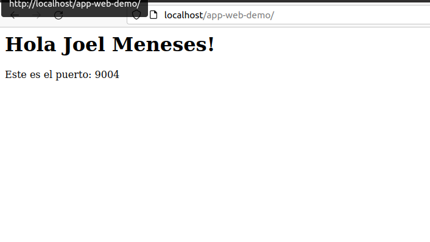
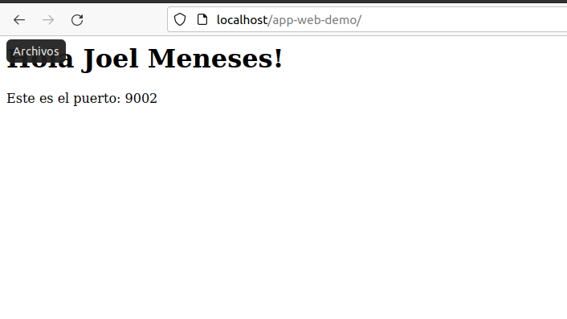
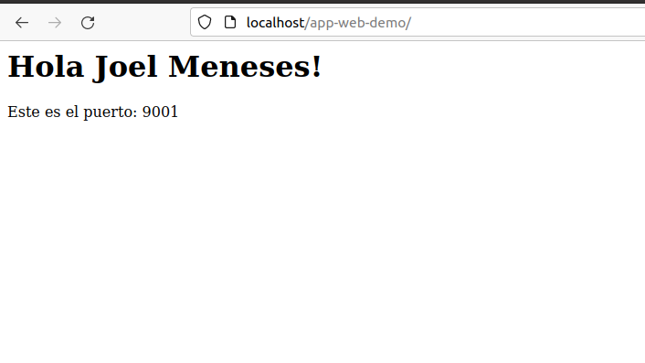
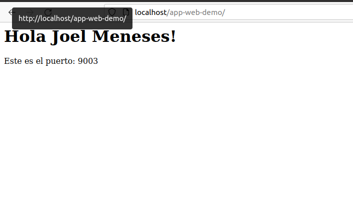

 

# Índice #

## 1. Activacion de los modulos necesarios en Apache ##
## 2. Configuración de Apache para trabajar como balanceador de carga para el tráfico HTTP##

**1. Activacion de los modulos necesarios en Apache**

Activamos los nodos ncesarios en apache, que son los de la siguiente imagen

Para desactivar un modulo es con el comando siguiente

> a2dismod proxy_ajp

Una vez realizado el paso anterior reiniciaremos el servicio Apache

>   systemctl restart apache2

**2. Configuración de Apache para trabajar como balanceador de carga para el tráfico HTTP**

Editamos el archivo 000-default.conf que está en el directorio /etc/apache2/sites-available:

Comprobamos el puerto apache

Añadimos las directivas Proxy y ProxyPass dentro de VirtualHost.

Tendremos que reemplazar IP-HTTP-SERVER-1, IP-HTTP-SERVER-2, IP-HTTP-SERVER-3, y IP-HTTP-SERVER-4, en nuestro caso deberá de ser localhost para las máquinas que estamos utilizando como Front-End

Utilizamos la app web de tareas anteriores, para crear una instancias de 4 nodos

El unico fichero que hay que modificar es docker-compose.yml

Luego haremos un mvn clean install para crearnos el war

Seguidamente eliminamos cualquier contenedor con el siguiente comando

> docker-compose down

Luego construimos las imagenes

>docker-compose up --build

Abrimos el navegador y lo probamos

Enlace github: <a href="https://github.com/joel92MM/Git/tree/main/Balanceo_de_Carga_Apache">enlace</a>
