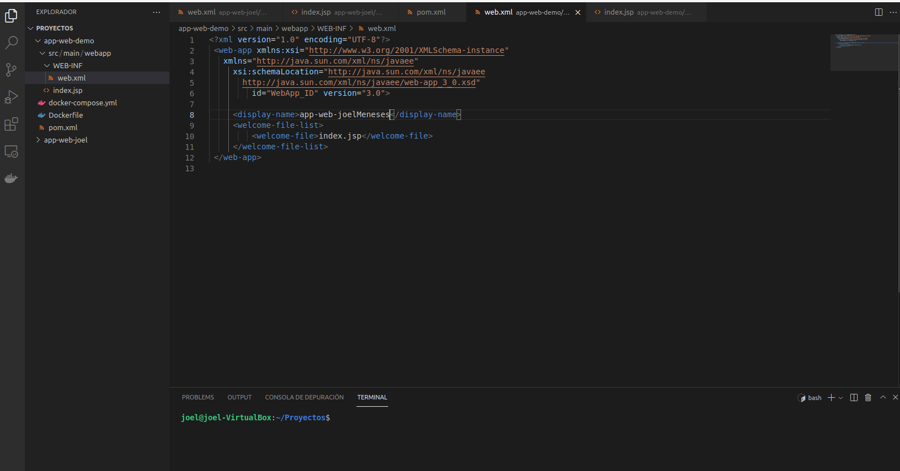
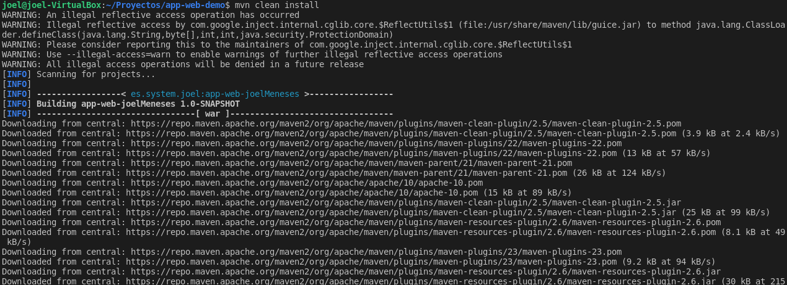

 

# Índice #

## 1. Instalación de Docker Compose ##

*  ## 1.1 Requisitos para instalar Docker Compose  ##

*  ## 1.2 Instalar Docker Compose en linux ##

## 2. Desplegando un Cluster de JBOSS con Docker ##

*  ## 2.1 Construcción del proyecto  ##

**1. Instalación de Docker Compose**

***1.1 Requisitos para instalar Docker Compose***

Tener instalado Docker en nuestro sistema operativo

***1.2 Instalar Docker Compose en Linux***

Para descargar la versión estable actual de Docker Compose, ejecutamos el siguiente comando

>  sudo curl -L "https://github.com/docker/compose/releases/download/1.29.2/docker-compose-$(uname -s)-$(uname -m)" -o /usr/local/bin/docker-compose

Posteriormente aplicamos permisos ejecutables al archivo binario

>  sudo chmod +x /usr/local/bin/docker-compose

Seguidamente crearemos un enlace simbólico, con el siguiente comando

>  sudo ln -s /usr/local/bin/docker-compose /usr/bin/docker-compose

Para saber si tenemos Docker Compose instalado, ejecutaremos el siguiente comando

> docker-compose --version

**2. Desplegando un Cluster de JBOSS con Docker**

En el siguiente <a href="">enlace</a> dispones de un proyecto de una app en Java, donde debes de realizar los siguientes cambios:

Abrimos el proyecto con un editor de codigo en nuestro caso VSCODE

En el fichero <strong>web.xml</strong> sustituiremos...

>    <display-name>app-web-alumno</display-name>  

 donde alumno seria nuestro alumno 

En el fichero <strong>index.jsp</strong> realizaremos el mismo procedimiento que en el punto anterior 

En el pom sustituiremos el nombre alumno por nuestro nombre

Abriremos la terminal de VSCODE, y añadiremos los comandos que se muestran en la imagen para acceder al proyecto

Seguidamente lanzamos el siguiente comando

> mvn clean install

En la carpeta target veremos el war que nos a creado

Una vez construido el proyecto, podremos ver el resultado ejecutando en modo local el siguiente comando

>mvn clean jetty:run

Una vez terminada de ejecutar jetty podemos ver el resultado en nuestro navegador escribiendo lo siguiente

> localhost:8082

Nos mostrara un mensaje como el siguiente

Dentro de la carpeta de nuestra instalación debemos construir el dichero Dockerfile con el contenido siguiente: 

FROM jboss/wildfly 

ARG WAR_FILE=target/*.war 
##COPY ${JAR_FILE} app.jar 

ADD ${ARG} /opt/jboss/wildfly/standalone/deployments/ 

ARG WILDFLY_NAME 
ARG CLUSTER_PW 

ENV WILDFLY_NAME=${WILDFLY_NAME} 
ENV CLUSTER_PW=${CLUSTER_PW} 

ENTRYPOINT /opt/jboss/wildfly/bin/standalone.sh -b=0.0.0.0 -bmanagement=0.0.0.0 -Djboss.server.default.config=standalone-full-ha.xml -Djboss.node.name=${WILDFLY_NAME} -Djava.net.preferIPv4Stack=true -Djgroups.bind_addr=$(hostname -i) -Djboss.messaging.cluster.password=${CLUSTER_PW} 

Seguidamente  el fichero .yml (docker-compose.yml) para la construcción del cluster con el siguiente contenido

version: '3.5' 
services: 

  wildfly1: 
    build: 
      context: . 
      args: 
        WILDFLY_NAME: wildfly_1 
        CLUSTER_PW: secret_password 
    image: wildfly_1 
    ports: 
    - 8080:8080 
    networks: 
      wildfly_network: 

  wildfly2: 
    build: 
      context: . 
      args: 
        WILDFLY_NAME: wildfly_2 
        CLUSTER_PW: secret_password 
    image: wildfly_2 
    ports: 
    - 8081:8080 
    networks: 
      wildfly_network: 

networks: 
  wildfly_network: 
    ipam: 
      driver: default 

Observamos que existe:

Dos servidores WILDFLY (1/2). 
Distintos puertos para el arraque de cada uno. 
CLUSTER_PW: clave para la construcción del cluster. 
networks: wildfly_network. Subred que estamos construyendo. 
ipam: Configuración de la subred. 

Abriremos la carpeta Dockerfile y hacemos los siguiente

Posteriormente listaremos las imagenes con el comando 

>sudo docker-compose -a

Y luego las borramos todas con el siguiente comando

> sudo docker rmi $(sudo docker images -a -q) -f

Ahora subiremos el war para desplegarlo en los dos puertos, con el comando 

> sudo docker-compose up --build

Ahora tendremos desplegada la aplicación accesible a través del puerto 8081 

Puerto 8080

Puerto 8081

Enlace github: <a href="https://github.com/joel92MM/Git/tree/main/Clusterizando_APP_Wildfly">enlace</a>
