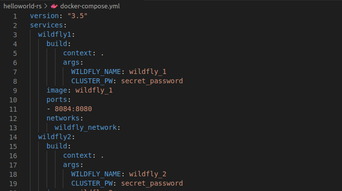

 

# Índice #

## 1. Desplegar una aplicación ##

**1. Desplegar una aplicación**

Utilizaremos una aplicación que se encuentra disponible en este <a href="https://github.com/joel92MM/Git/tree/main/Clusterizando_Servicio_Rest_Wildfly/helloworld-rs">enlace</a>

Abriremos nuestro editor de código en nuestro caso VSCODE, y crearemos un nuevo proyecto, con la siguiente estructura de carpetas

En nuestra carpeta crearemos el archivo Dockerfile con el siguiente contenido de la imagen

Nos vamos al dichero **Dockerfile** , introducimos la versión **8.0.0 de phph con apache **

Este es el .sql que se importa a **MySQL**

En el fichero de configuración **docker-compose.yml** configuraremos los siguientes servicios. En este punto, encontramos 3 bloques importantes donde se definen los servicios: **www, db y phpmyadmin**

Una vez hecho esto crearemos el fichero war mediante el comando..

> mvn clean install

Construimos los contenedores

Listamos y comprobamos si los contenedores estan funcionando

Seguidamente para verificar que todo funcuona correctamente ejecutamos el siguiente comando 

> mvn clean jtty:run

Accedemos al navegador para ver si los puertos estan funcionando

Comprobamos el acceso a phpmyadmin desde el puerto 8000

Finalmente el acceso a la aplicacion no se ejecuta

Enlace github: <a href="https://github.com/joel92MM/Git/tree/main/Clusterizando_Servicio_Rest_Wildfly">enlace</a>
