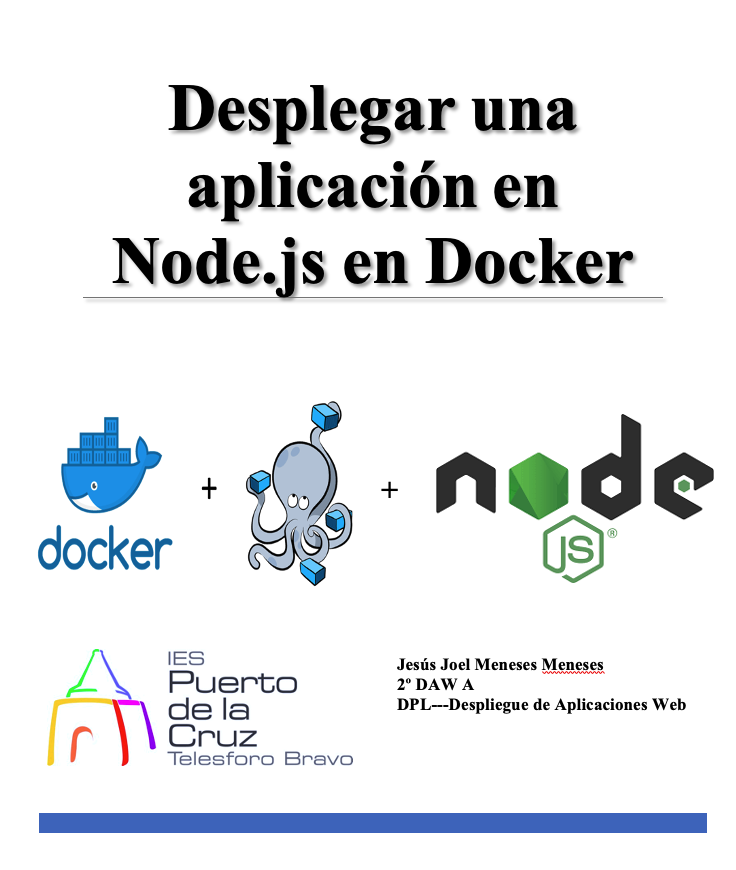

 

# Índice #

## 1. Crear la aplicación Node.js ##
## 2. Creando un Dockerfile##
## 3. Construyendo la imagen##
## 4. Ejecutando la imagen##
## 5. Probando la imagen##

**1. Crear la aplicacion Node.JS**

Antes de nada actualizaremos nuestro repositorio de paquetes, con el comando..

> sudo apt update && apt upgrade

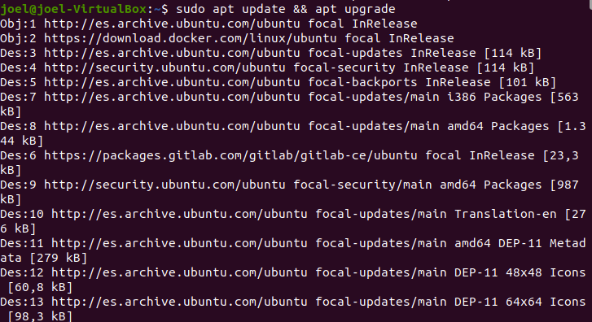

Seguidamente instalaremos un gestor de paquetes con los siguientes comandos

> curl -fsSL https://deb.nodesource.com/setup_lts.x | sudo -E bash -

> sudo apt-get install -y nodejs

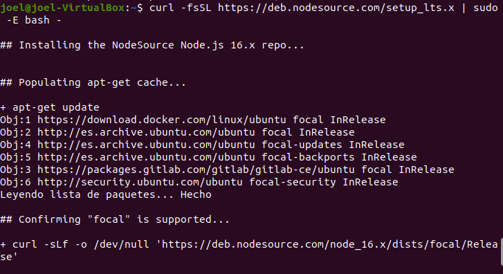
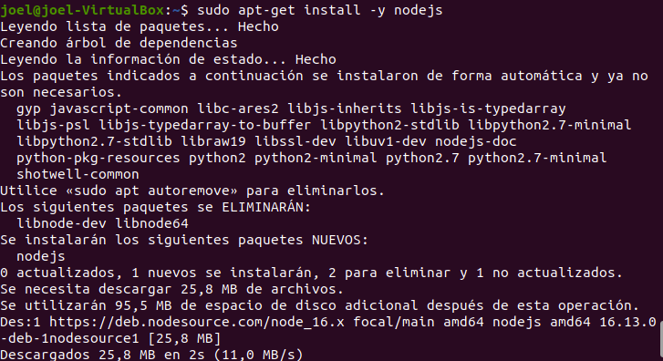

Comprobamos que esta instalado la version 8.1.0 con el siguiente comando

> npm --version

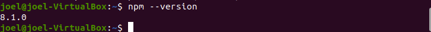

Primero nos crearemos un nuevo directorio donde estarán todos los archivos

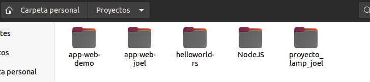

 posteriormente abriremos VSCODE, con la carpeta creada y dentro de ella crearemos el archivo *package.json* con el contenido siguiente 

* 
{
  "name": "docker_web_app", 

  "version": "1.0.0", 

  "description": "Node.js on Docker", 

  "author": "First Last <first.last@example.com>", 

  "main": "server.js", 

  "scripts": { 

    "start": "node server.js" 

  }, 

  "dependencies": { 

    "express": "^4.16.1" 

  } 

}

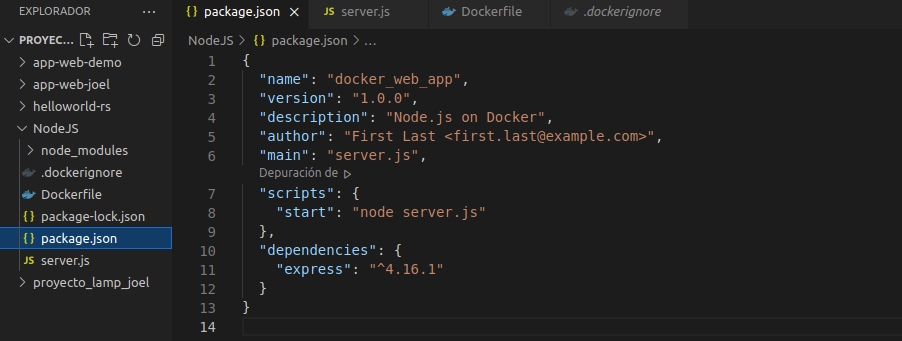

Ahora ejecutamos el comando siguiente, que nos generará un package-lock.json que se copiará a su imagen de Docker.

> npm install

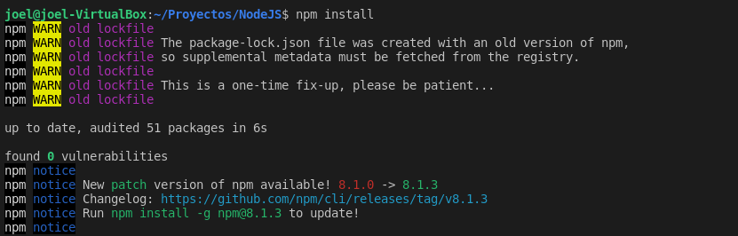

Luego, cree un server.jsarchivo que defina una aplicación web usando el marco Express.js con el contenido siguiente

* 

'use strict'; 

const express = require('express'); 

// Constants 

const PORT = 8080; 

const HOST = '0.0.0.0'; 

// App 

const app = express(); 

app.get('/', (req, res) => { 

  res.send('Hello World'); 

}); 

app.listen(PORT, HOST); 

console.log(`Running on http://${HOST}:${PORT}`); 

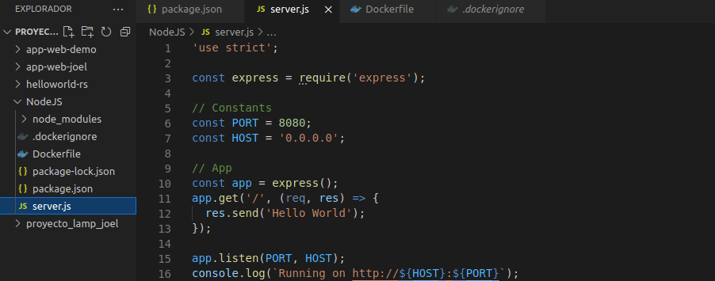

**2. Creando un Dockerfile**

Creamos un archivo vacío llamado Dockerfile con el siguiente comando

>touch Dockerfile

Dentro del archivo escribiremos el siguiente contenido

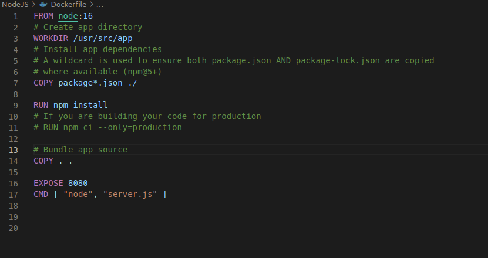

Ahora crearemos un .dockerignore en el mismo directorio que el Dockerfile con el siguiente contenido:

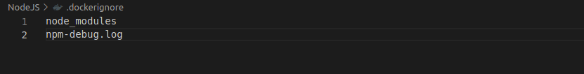

Esto evitará que sus módulos locales y registros de depuración se copien en la imagen de Docker y posiblemente sobrescriban los módulos instalados dentro de su imagen.

**3. Construyendo la imagen**

Vamos al directorio que tiene Dockerfile y ejecutamos el siguiente comando para construir la imagen de Docker. La -t bandera permite etiquetar la imagen para que sea más fácil encontrarla más tarde usando el docker images el comando es 

> docker build . -t joel/node-web-app

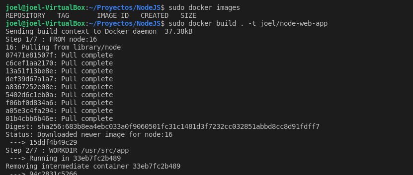

Listamos las imagenes de docker

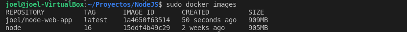

**4. Ejecutando la imagen**

 Crearemos un contenedor con la imagen creada anteriormente con el comando...

> docker run -p 49160:8080 -d joel/node-web-app

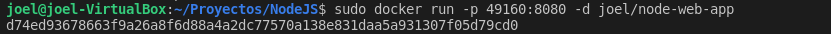

Obtenemos el ID del contenedor con el comando siguiente

> sudo docker ps

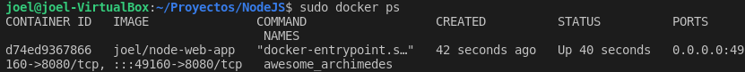

Obtenemos la salida de la aplicacion

> sudo docker logs <container id>

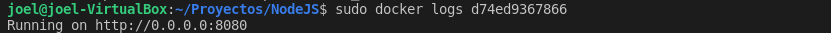

Ingresamos el contenedor con el comando

>docker exec -it <container id> /bin/bash

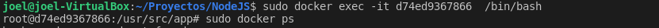

**5. Probando la imagen**

Ahora probamos la aplicación 

Ingresamos en el navegador la siguiente dirección de la imagen 

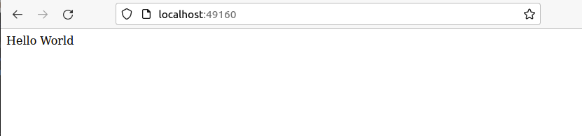

Enlace github: <a href="https://github.com/joel92MM/Git/tree/main/Desplegar_Aplicacion_NodeJS_Docker">enlace</a>
