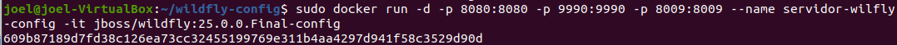

 

## 1. Creación del fichero dockerfile para Wildfly. ##

Creamos el directorio de trabajo, con el siguiente comando: 

>  mkdir wildfly-config
  cd wildfly-config

Creamos el fichero de configuración, con el siguiente comando: 

>  nano Dockerfile

Añadimos la configuración de nuestra imagen 

# Base image
FROM jboss/wildfly:25.0.0.Final
 
# Maintainer
MAINTAINER "jpexposito" "mail@example.com"
 
# Create user admin with password admin
RUN /opt/jboss/wildfly/bin/add-user.sh admin admin --silent
 
# Add custom configuration file
  
# ADD standalone.xml /opt/jboss/wildfly/standalone/configuration/
 
# Add example.war to deployments
 
# ADD example.war /opt/jboss/wildfly/standalone/deployments/
 
# JBoss ports
EXPOSE 8080 9990 8009
 
# Run
CMD ["/opt/jboss/wildfly/bin/standalone.sh", "-b", "0.0.0.0", "-bmanagement", "0.0.0.0", "-c", "standalone.xml"]

Construcción de la imagen

> sudo docker build -q --rm --tag=jboss/wildfly:25.0.0.Final-config .

Obteniendo una salida similar a: 

Verificamos que existe la imagen dentro de docker con el comando 

> sudo docker images

Hemos construido nuestra primera imagen en docker

## 2. Uso de la nueva imagen##

Verificaremos que nuestra imagen se ejecuta con el comando

>sudo docker run -d -p 8080:8080 -p 9990:9990 -p 8009:8009 --name servidor-wilfly-config -it jboss/wildfly:25.0.0.Final-config

Teniendo en cuenta el parámetro --name servidor-wilfly-config que indica el nombre del servidor que hemos creado y arrancado, y que debe de ser significativo. Obtenemos, algo similar a:

>f02cdd6962b18134ba34e6ba03331a65526c30fdcf3d961ac8d4817b7f0007e5

Ahora verificaremos que el contenedor esta arrancado con el comando

> sudo docker ps -a

Accedemos a la consola de wildfly, y verificamos que se puede entrar en la consola de administración con el usuario admin.

Enlace github: <a href="https://github.com/joel92MM/Git/tree/main/Dockerizando_Wildfly_Linux">enlace</a>
