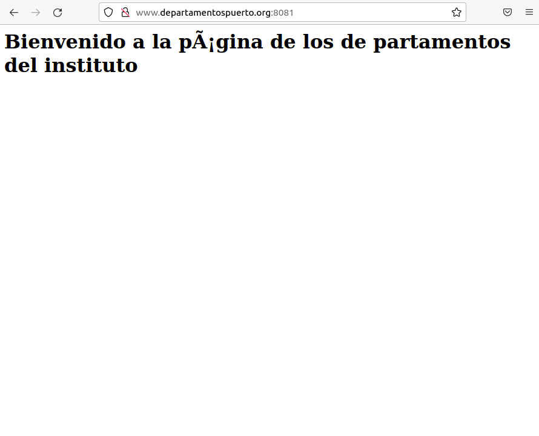

 

El servidor web Apache2 se instala por defecto con un host virtual. Su configuración esta..

> /etc/apache2/sites-available/000-default.conf

Construimos dos nombres de dominio 

> www.iespuerto.org
> www.departamentospuerto.org

Donde el directorio base sera 

> /var/www/nombre_directorio

Sus páginas web seran

> index.html

Contenido de la pagina 

>Bienvenid@ a la página del nombre_directorio

Los ficheros de configuración de los sitios webs se encuentran en el directorio /etc/apache2/sites-available, por defecto hay dos ficheros, uno se llama 000-default.conf que es la configuración del sitio web por defecto. Necesitamos tener dos ficheros para realizar la configuración de los dos sitios virtuales, para ello vamos a copiar el fichero 000-default.conf

> cd /etc/apache2/sites-available

> cp 000-default.conf iespuerto.conf

> cp 000-default.conf departamentos.conf

Modificamos los ficheros iespuerto.conf y departamentos.conf, para indicar el nombre que vamos ausar para acceder al host virtual (ServerName) y el directorio detrabajo (DocumentRoot).

es necesario crear un enlace simbólico a estos ficheros dentro del directorio /etc/apache2/sites-enabled

> a2ensite iespuerto
> a2ensite departamentos

Si queremos deshabilitar los enlaces simbolicos usaremos

>a2dissite nombre_dichero_configuracion

Reiniciamos los servicios

Para finalizar cambiamos el fihero host en el cliente para introducir dos nuevas lineas donde haga conversacion nombre de dominio-> direccion de servidor

Tras esto paramso y inicializamos el servidor apache, y mostraremso las pagians web enel navegador

