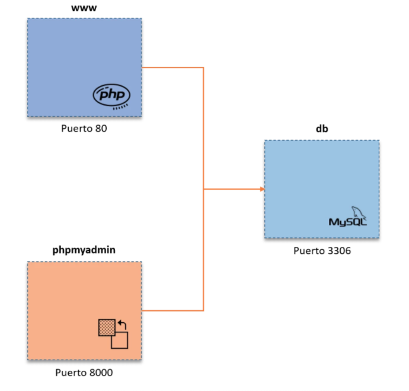
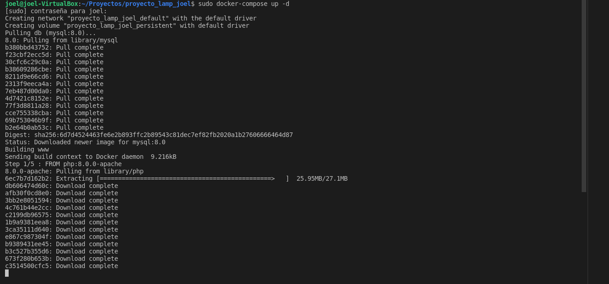
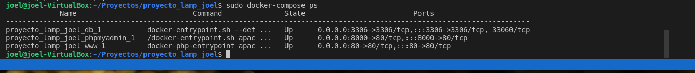

 

# Índice #

## 1. Práctica de una pila LAMP ##

## 2. Servidor web ##

**1. Práctica de una pila LAMP**

Una pila es un conjunto de servicios o paquetes instalables y que se relacionan entre si. En el siguiente diagrama se puede observar una pila LAMP (GNU/Linux, Apache, MySQL y PHP).

**2. Servidor web**

A continuación vamos a crear una estructura con 3 contenedores que conforman un sistema distribuido, interconectados entre si. Cada contenedor tiene servicios distintos que hará que la pila LAMP se constituye por medio de una red local.

***Servidor web***

  - Nombre del contenedor: **www**
  - Puerto: **80**

***Servidor de BBDD***

  - Nombre del contenedor: **db**
  - Puerto: **3306**

***Servidor del sistema gestor de base de datos gráfico***

  - Nombre del contenedor: **phpmyadmin**
  - Puerto: **8000**

Abriremos nuestro editor de código en nuestro caso VSCODE, y crearemos un nuevo proyecto, con la siguiente estructura de carpetas, como se muestra en la siguiente imagen

Nos vamos al dichero **Dockerfile** , introducimos la versión **8.0.0 de phph con apache **

Seguidamente cambiaremos  la variable de entorno **DEBIAN_FRONTED** a modo no interactivo, que lo define para que los demás paquetes de instalación en consecuencia que soliciten una confirmación de algo en ejecución, lo omitan.

Las demás ejecuciones ya son para instalar extensiones de comunicación con docker, php y mysqli, así como las actualizaciones del repositorio de paquetes y por último la instalación de librerías y dependencias.

En el fichero de configuración **docker-compose.yml** configuraremos los siguientes servicios. En este punto, encontramos 3 bloques importantes donde se definen los servicios: **www, db y phpmyadmin**

Este es el .sql que se importa a **MySQL**

Este código php ubicado en **www/index.php** es para comprobar que el sitio carga bien y que existe correcta conectividad con la base de datos y que este puede dar lectura.

Ahora abriremos el terminal, listamos las carpetas de nuestra carpeta raíz, verificamos si se encuentra el proyecto creado, y entramos en la carpeta

Introduciremos el siguiente comando, que ejecuta la configuración de los contenedores en segundo plano

Los datos resultantes son de que se crean 3 contenedores, en principio con los prefijos docker-lamp_ que es el directorio donde se encuentra, procediendo a concatenar el nombre del contenedor y el sufijo _1 con resultado done.
 
Para verificar los contenedores corriendo desde Docker Compose:

Con esto bastará para hacer la prueba en un navegador y escribir **127.0.0.1**, equivalente a **127.0.0.1:80** o **localhost:80** con el puerto opcional.

Se procede a realizar una consulta a la dirección 127.0.0.1:8000 para llegar al contenedor phpmyadmin. El usuario y la contraseña han sido definidos en el .yml.

Comprobamos que el acceso ha sido correcto, también verificamos que la base de datos se encuentra bien importada con su respectiva tabla y datos dentro, listo para ser gestionada.

A partir de aquí, vamos a colocar el proyecto a trabajar, dentro del directorio www/, por ejemplo, si tu proyecto se llama app-servidor, lo revisarás en tu navegador como 127.0.0.1/app-servidor.

Para detener el stack con Docker Compose, es de esta manera:

>  docker-compose stop

Enlace github: <a href="https://github.com/joel92MM/Git/tree/main/Infraestructura_Lamp_Docker_Compose">enlace</a>
