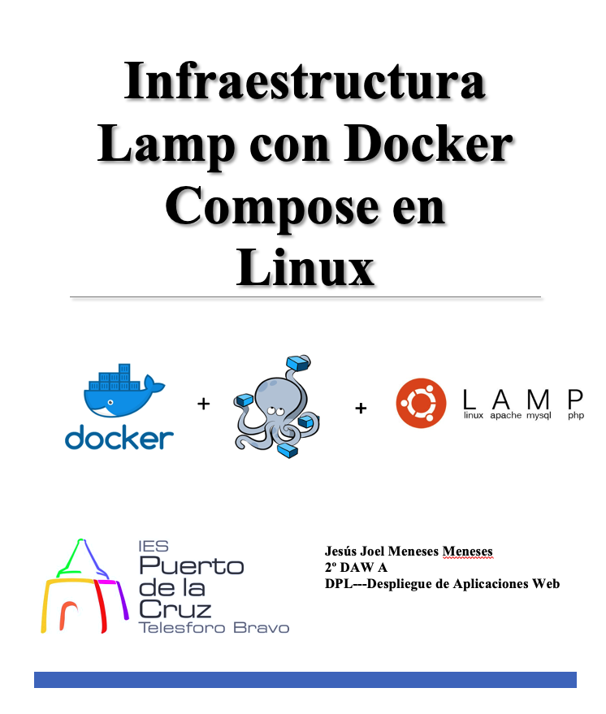

 

# Índice #

## 1. Práctica de una pila LAMP ##

## 2. Servidor web ##

**1. Práctica de una pila LAMP**

Una pila es un conjunto de servicios o paquetes instalables y que se relacionan entre si. En el siguiente diagrama se puede observar una pila LAMP (GNU/Linux, Apache, MySQL y PHP).

**2. Servidor web**

A continuación vamos a crear una estructura con 3 contenedores que conforman un sistema distribuido, interconectados entre si. Cada contenedor tiene servicios distintos que hará que la pila LAMP se constituye por medio de una red local.

***Servidor web***

  - Nombre del contenedor: **www**
  - Puerto: **80**

***Servidor de BBDD***

  - Nombre del contenedor: **db**
  - Puerto: **3306**

***Servidor del sistema gestor de base de datos gráfico***

  - Nombre del contenedor: **phpmyadmin**
  - Puerto: **8000**

Abriremos nuestro editor de código en nuestro caso VSCODE, y crearemos un nuevo proyecto, con la siguiente estructura de carpetas, como se muestra en la siguiente imagen

Nos vamos al dichero **Dockerfile**, introducimos la versión **8.0.0 de phph con apache **

Seguidamente cambiaremos  la variable de entorno **DEBIAN_FRONTED** a modo no interactivo, que lo define para que los demás paquetes de instalación en consecuencia que soliciten una confirmación de algo en ejecución, lo omitan.

Las demás ejecuciones ya son para instalar extensiones de comunicación con docker, php y mysqli, así como las actualizaciones del repositorio de paquetes y por último la instalación de librerías y dependencias.

Enlace github: <a href="https://github.com/joel92MM/Git/tree/main/Infraestructura_Lamp_Docker_Compose">enlace</a>
