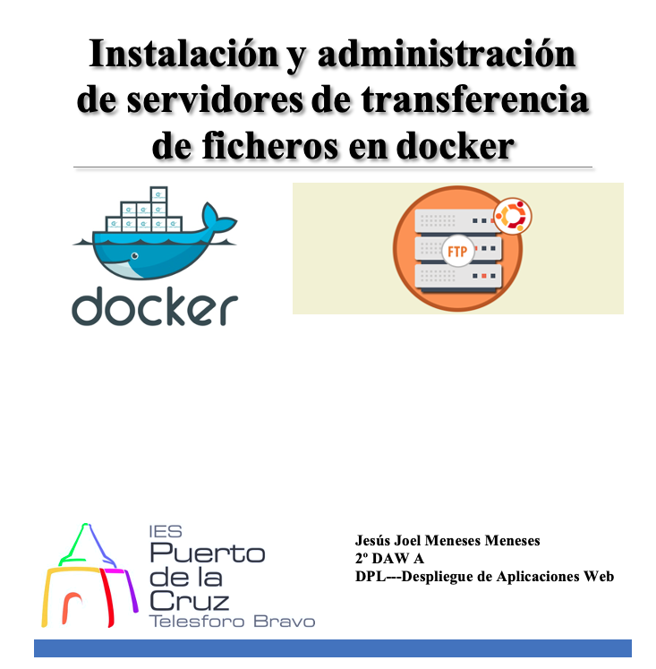

# Índice #

## 1. Requisitos básicos ##

## 2. Busquedas de imágenes creadas ##

## 3. Trabajar con la imagen atmoz  ##

## 4. Verificar la imagen ##

## 5. Configurar el directorio home en la máquina host. ##

## 6. SFTP Multiusuario ##

**1. Requisitos básicos**

- Disponer de una máquina Ubuntu 20.04
- Internet

**2. Búsquedas de imágenes creadas**

Podemos consultar las imágenes creadas para la instalación de SFTP, con el comando...

***2.1 Instalando el paquete vsftpd***

Si el firewall UFW está activado en Ubuntu debemos de permitir el acceso a los puertos estándar del servicio FTP, con el comando...

> sudo ufw allow ftp

Y el puerto de datos, para el modo activo con el comando...

> sudo ufw allow ftp-data

Creamos una copia de el archivo de configuracion original de ftp, con el comando

**3. Verificar el servicio FTP en Ubuntu**

Accederemos al navegadorn donde introducimos la direccion ftp://ip, pero muestra solo la ventana siguiente

De otra manera, si accedemos por el terminal introduciendo ftp ip, entramos dentro pidiendo las credenciales de nuestro usuario con contraseña para entrar

Ahora probaremos a acceder desde un cliente como Filezilla, primeramente lo instalaremos con el comando.. 

> sudo apt install filezilla

Accederemos al terminal, introducimos el siguiente comando para acceder a nuestro cliente filezilla

> filezilla

A continuación nos conectaremos, introduciendo el servidor, usuario y contraseña

**4. Configurar el servidor FTP**

Incluso si accedemos desde una máquina Windows sin firewall, aunque con el cliente de consola podríamos acceder sin problemas, al tratar de acceder desde navegadores como Google Chrome la operación debería fallar.

Por lo tanto configurar el modo pasivo del servidor FTP en Ubuntu será útil para muchos escenarios. Para ello editaremos vsftpd.conf con el siguiente comando..

Añadiremos las siguientes directivas al final del archivo de configuración:

> pasv_enable=YES
> pasv_min_port=30000
> pasv_max_port=30050

Terminada la configuración, guardamos los cambios y recargamos la configuración del servicio:

Si el servidor Ubuntu tiene activado el firewall UFW, habrá que permitir el acceso al rango de puertos que acabamos de configurar:

Ahora verificamos el acceso desde el terminal

Probamos a verificar el acceso desde el cliente filezilla

Introduciendo el puerto no conecta con el servidor

Introduciendo el servidor, usuario, contraseña no conecta con el servidor

 Acceso de usuarios del sistema Por defecto el servidor FTP vsFTPd trabaja con los usuarios del sistema, que deberán autenticarse debidamente para acceder al servicio. Si sólo quieres usuarios anónimos podrás desactivar el acceso a usuarios del sistema modificando la directiva local_enable, donde cambiaremos yes por no. Pero si deseas mantenerlos hay ciertos ajustes que pueden ser interesantes, como que los usuarios locales puedan escribir en sus directorios

Descomentando la directiva write_enable manteniendo el valor YES los usuarios podrán crear o eliminar archivos y directorios

Activaremos otra caracteristica para que los usuarios locales pueden navegar por todo el sistema de archivos de Ubuntu, cuando podría ser más interesante que solamente pudieran acceder a sus directorios personales.

Esta característica no se puede activar si la raíz del directorio personal (es decir, el directorio /home/usuario) es escribible, para evitar eliminar archivos o directorios esenciales, así que o cambiamos los permisos de estos directorios (como ocurre en servicios de hosting, por ejemplo), o añadimos la directiva allow_writeable_chroot

Enlace github: <a href="https://github.com/joel92MM/Git/tree/main/2ºTrimestre/Instalacion_Administracion_Servidores_Transferencia_Archivos_Docker">enlace</a>
