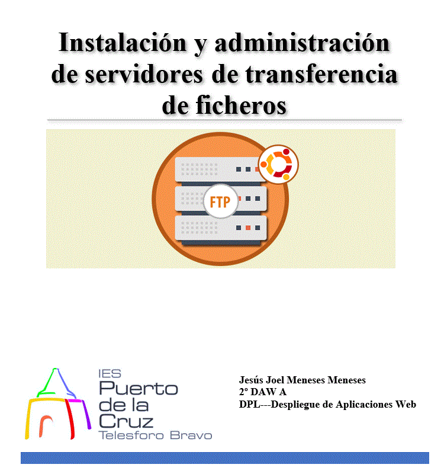

# Índice #

## 1. Requisitos básicos ##

## 2. ¿Cómo instalar FTP? ##

*  ## 2.1 Instalando el paquete vsftpd  ##

## 3. Verificar el servicio FTP en Ubuntu  ##

## 4. Configurar el servidor FTP ##

## 5. Instalación de un cliente o utilización de un cliente ##

**1. Requisitos básicos**

- Disponer de una máquina Ubuntu 20.04
- Internet

**2. ¿Cómo instalar FTP?**

Vamos a instalar el servidor FTP vsFTPd en Ubuntu 20.04 desde los repositorios de la distribución, así que la primera acción será actualizar la información de los repositorios, con el comando...

> sudo apt update && apt upgrade

***2.1 Instalando el paquete vsftpd***

Vamos a instalar el paquete ftp con el comando siguiente..

> sudo apt install -y vsftpd

Obtenemos un mensaje similar al siguiente

Para comprobar el estado del servidor FTP utilizamos el comando..

> sudo systemctl status vsftpd

Si el firewall UFW está activado en Ubuntu debemos de permitir el acceso a los puertos estándar del servicio FTP, con el comando...

> sudo ufw allow ftp

Y el puerto de datos, para el modo activo con el comando...

> sudo ufw allow ftp-data

Creamos una copia de el archivo de configuracion original de ftp, con el comando

**3. Verificar el servicio FTP en Ubuntu**

Accederemos al navegadorn donde introducimos la direccion ftp://ip, pero muestra solo la ventana siguiente

De otra manera, si accedemos por el terminal introduciendo ftp ip, entramos dentro pidiendo las credenciales de nuestro usuario con contraseña para entrar

