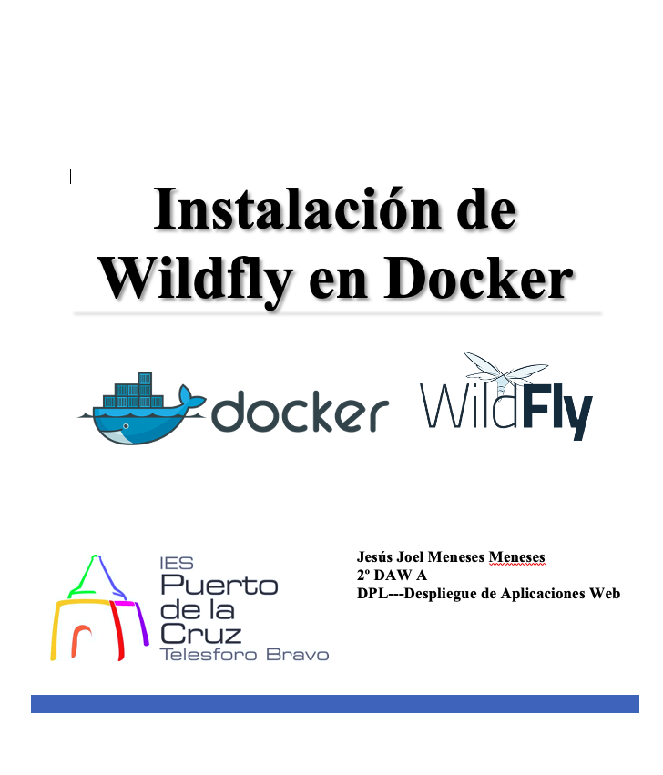
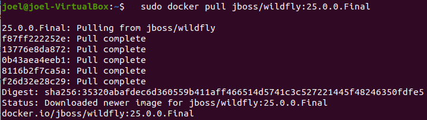
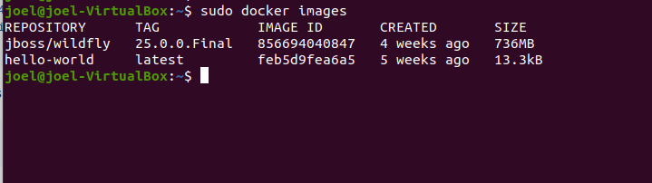
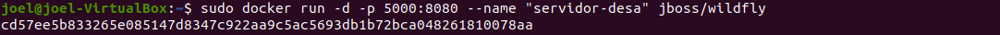
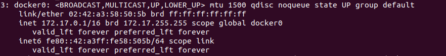
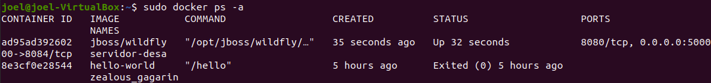
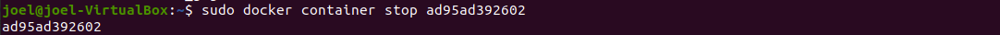
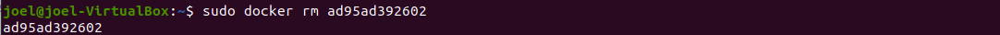
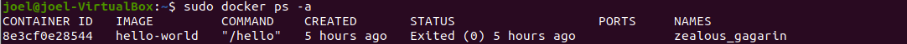
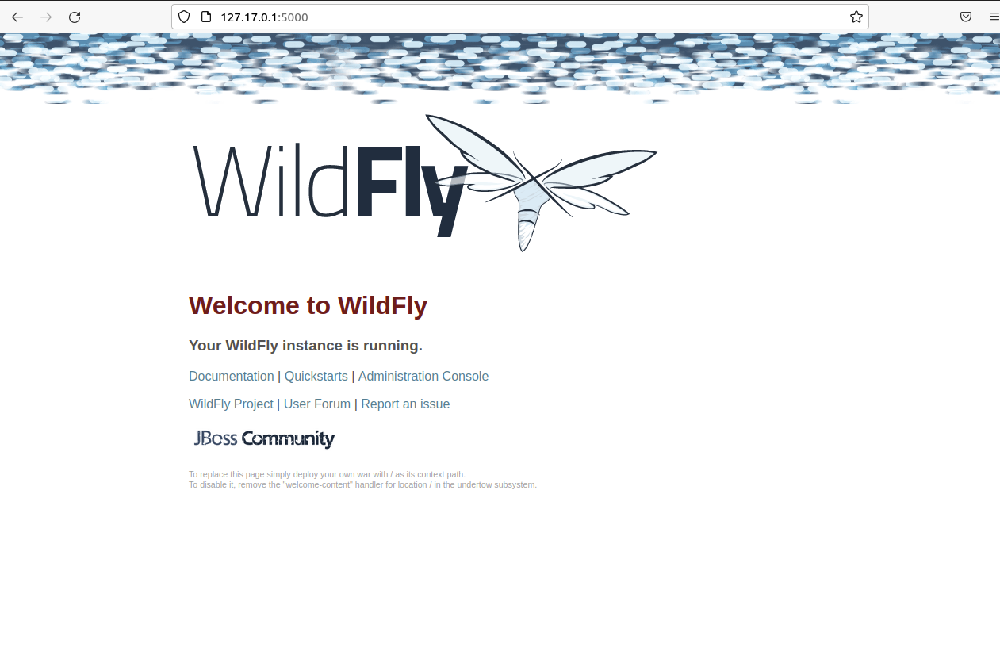

# Índice #

## 1. Descarga de la imagen del docker Wildfly. ##

 

**1. Descarga de la imagen del Docker Wildfly**

Este paso es opcional ya que al construir nuestra imagen basada en el fichero Dockerfile se descargará la imagen base si no la tenemos en nuestro repositorio. Vamos a descargar en concreto la versión 25.0.0.Final de la imagen oficial. Para ello, vamos a utilizar el tag correspondiente:

>   sudo docker pull jboss/wildfly:25.0.0.Final

Obtendremos un mensaje como el siguiente

Veremos el listado de imagenes descargadas con el siguiente comando

> sudo docker images

Arrancamos un contenedor con la imagen y comprobamos que esta disponible el servidor de aplicaciones

>sudo docker run -d -p 5000:8080 --name "servidor-desa" jboss/wildfly

Donde (ver diagrama abajo):

+ -d (daemon) → arranca el servidor en background  
-p 5000:8080 → publica el puerto 8080 de Wildfly al puerto 5000 del host (en nuestro caso el host es nuestro equipo) 
--name “servidor-desa” → define un alias para el contenedor  
+ c1bd… → es el código del contenedor (el hostname dentro de Docker) 

Con el siguietne comando veremos que docker a creado una nueva red

>ip a

# Problemas que podemos encontrarnos #

Si no hemos equivocado al asignar el puerto y queremos eliminar el contenedor de la imagen hacemos lo siguiente: 

Primero listamos los contenedores que estan en ejecucion

Luego paramos el contenedor introduciendo el ID

Por ultimo eliminamos el contenedor dejando el puerto libre

Volvemos a listar los contenedores y veremos que hemos eliminado el deseado

Accediendo a la IP:puerto podemos ver la instalación

Enlace github: <a href="https://github.com/joel92MM/Git/tree/main/Instalacion_Wildfly_en_Docker">enlace</a>
