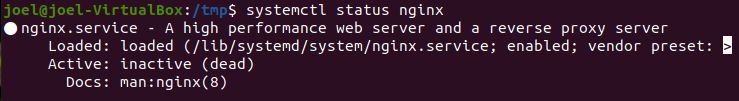

 

# Índice #

## 1. Requisitos previos para la instalación ##

## 2. Pasos para instalar y configurar Ngnix ##

*  ## 2.1 Instalar Nginx ##

*  ## 2.2 Aplicar ajustes al firewall ##

*  ## 2.3 Comprobar su servidor web ##

*  ## 2.4 Administrar el proceso de Nginx ##

*  ## 2.5 Configurar bloques de servidor ##

**1. Requisitos  previos a la instalación**

Tener un S.O. Ubuntu 20.04 con un cuenta de superusuario no root. 

**2. Pasos para instalar y configurar Nginx**

***2.1 Instalar Nginx***

Primeramente antes de instalar nginx, actualizaremos nuestro indice local de repositorios de paquetes, teniendo acceso a los listados de paquetes más recientes, con el siguiente comando...

> sudo apt update

Una vez finalizada, la actualización de paquetes , instalaremos nginx, nos instalara cualquier dependencia necesaria en su servidor, ejecutando el siguiente comando

> sudo apt install Nginx

***2.2 Aplicar ajustes al firewall***

Mostraremos un listado de los perfiles de la aplicación, con el siguiente comando..

> sudo ufw app list

Se mostrará un listado como el siguiente

Hanilitaremos el puerto, con el siguiente comando..

> sudo ufw allow 'Nginx HTTP'

Verificaremos el cambio con el siguiente comando 

> sudo ufw status

***2.3 Comprobar su servidor web***

Ahora verificamos que el servicio esté en ejecución, con el siguiente comando..

> systemctl status Nginx

Nos mostrará los siguiente

Si queremos configurar un servidor que se encuentra en la nube escribimos..

>   curl -4 icanhazip.com

Luego copiamos la direccion ip en el navegador y se mostrara lo siguiente 

El problema son los puertos para ello tenemos que ir a la siguiente carpeta y escribir un puerto libre en nuestro caso es 8085

Antes tendremos que darle permiso de escritura para cambiar los puertos con el comando que se muestra en la imagen 

Ahora entramos en la carpeta para cambiar los puerto con el siguiente comando 

Y procedemos a cambiar los puertos

Y como se muestra en la imagen estaria iniciado el servicio

***2.4 Administrar el proceso de Nginx***

Ahora vamos a revisar algunos comandos básicos para comprobar que todo esta bien

Detenemos el servidor web, escribiendo

> sudo systemctl stop nginx

Iniciamos el servidor web

> sudo systemctl start nginx

Restauramos  el servicio 

> sudo systemctl restart Nginx

Recargamos la configuración de nginx

> sudo systemctl reload Nginx

Deshabilitamos el inicio automático de nginx, con el siguiente comando

> sudo systemctl disable nginx

Para habilitar el servicio automático, escribimos los siguiente 

> sudo systemctl enable nginx

***2.5 Configurar bloques de servidor***

Creamos un directorio con el nombre de dominio que le hemos dado, usando el indicador -p para cualquier direcotrio principal, escribiendo..

>   sudo mkdir -p /var/www/your_domain/html

Luego asisnamos la propiedad del directorio con la variable de entorno $USER, con el comando..

>  sudo chown -R $USER:$USER /var/www/your_domain/html

Permitimos al propietario leer, escribir y ejecutar archivos, concediendo solo permisos de lectura y ejecución a los grupos y terceros, con el siguiente comando

>  sudo chmod -R 755 /var/www/your_domain

A continuación, cree una página de ejemplo index.html utilizando nano, escribiendo...

>  nano /var/www/your_domain/html/index.html

Escribiendo lo siguiente

Crearemos un bloque de servidor con las directivas correctas, escribiendo lo siguiente 

>  sudo nano /etc/nginx/sites-available/your_domain

Escribiremos lo siguiente 

Habilitaremos  el archivo creando un enlace entre él y el directorio sites-enabled, en el cual Nginx obtiene lecturas durante el inicio, con el siguiente comando

>  sudo ln -s /etc/nginx/sites-available/your_domain /etc/nginx/sites-enabled/

Para evitar un problema de memoria de depósito de hash que pueda surgir al agregar nombres de servidor, es necesario aplicar ajustes a un valor en el archivo /etc/nginx/nginx.conf, escribiendo...

>   sudo nano /etc/nginx/nginx.conf

Encuentre la directiva server_names_hash_bucket_size y borre el símbolo # para eliminar el comentario de la línea, escribiendo...

Ruta

>  /etc/nginx/nginx.conf

Descomentamos la siguiente linea

> http {
   ...
   server_names_hash_bucket_size 64;
   ...
 }
 ...

 

Comprobamos que no hay errores de sintaxis con el siguiente comando,,,

> sudo nginx -t

Reiniciamos nginx para habilitar los cambios 

>  sudo systemctl restart nginx

Enlace github: <a href="https://github.com/joel92MM/Git/tree/main/Instalacion_de_NGINX_LINUX">enlace</a>
