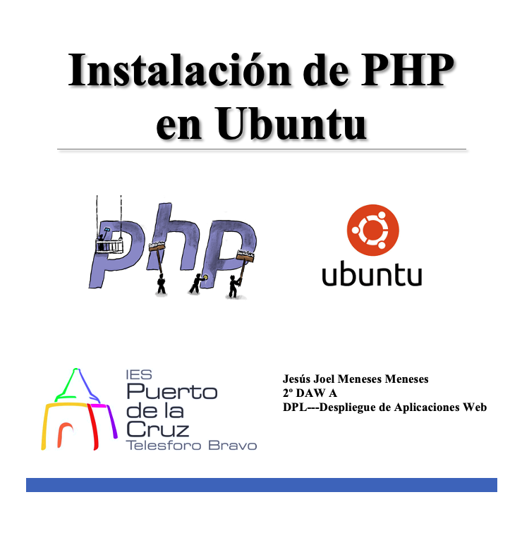

 
 

# Índice #

## 1. Requisitos previos para la instalación ##

## 2. Como instalar PHP en Ubuntu 20.04 ##

## 3. PHP para Apache ##

## 4. PHP para Nginx ##

## 5. Como probar PHP en Ubuntu 20.04 ##

## 6. Configuración de subdominios ##

**1. Requisitos  previos a la instalación**

Tener un S.O. Ubuntu 20.04 con un cuenta de superusuario no root. 

**2. Como instalar PHP en Ubuntu 20.04**

Como de costumbre, actualizaremos la lista de paquetes

> sudo apt update

**3. PHP para Apache**

 Si usas Apache como servicio web, el paquete que necesitas será libapache2-mod-php

>  sudo apt install -y php

**4. PHP para Nginx**

Si usas Nginx, el paquete que necesitas es php-fpm

> sudo apt install -y php-fpm

Será necesario configurar Nginx para conectar con el servicio PHP-FPM, editando su archivo de configuración, ya que PHP,se instala como servicio independiente

>   sudo nano /etc/nginx/sites-available/default

Buscamos esta sección: 

...
        # pass PHP scripts to FastCGI server 
        # 
        #location ~ \.php$ { 
        #       include snippets/fastcgi-php.conf; 
        # 
        #       # With php-fpm (or other unix sockets): 
        #       fastcgi_pass unix:/var/run/php/php7.4-fpm.sock; 
        #       # With php-cgi (or other tcp sockets): 
        #       fastcgi_pass 127.0.0.1:9000; 
        #}
...

Activamos el bloque location con la configuración adecuada, en este caso correspondiente al servicio PHP-FPM:

...
        # pass PHP scripts to FastCGI server 
        # 
        location ~ \.php$ { 
                include snippets/fastcgi-php.conf; 
        # 
        #       # With php-fpm (or other unix sockets): 
                fastcgi_pass unix:/var/run/php/php7.4-fpm.sock; 
        #       # With php-cgi (or other tcp sockets): 
        #       fastcgi_pass 127.0.0.1:9000; 
        }
...

Recargamos la configuracion de Nginx

>sudo systemctl reload nginx

Para ver la version instalada de PHP o si esta instalado utilizamos...

> php -v

**5. Como probar PHP en Ubuntu 20.04**

Para probar PHP en Ubuntu 20.04 crearemos un pequeño archivo fácilmente accesible vía web

>   sudo nano /var/www/html/info.php

El contenido es el siguiente: 

Ahora abriremos el navegador web e introducimos la siguiente direccion que se muestra en la imagen se vera una ventana similar

**6. Configuración de subdominios**

Copiaremos la pagina de php que hemos creado en la carpeta de subdominio de la práctica anterior, con el siguiente comando..

> cp /var/www/html/info.php /var/www/ejemplojoel/html/

Aplicaremos la misma configuracion al archivo de configuracion de subdominio ejemplojoel, como en la seccion anterior, con el comando...

> nano /etc/nginx/sites-available/ejemplojoel

Copiaremos el contenido en ese carpeta como se muestra en la imagen

Ahora recargamos el servicio nginx, con el comando

> sudo systemctl reload nginx

Posteriormente abriremos el navegador web e introducimos la direccion de nuestro servidor como se muestra en la imagen

Finalmente ya tendremos php instalado

Enlace github: <a href="https://github.com/joel92MM/Git/tree/main/Instalacion_de_PHP_Ubuntu">enlace</a>
