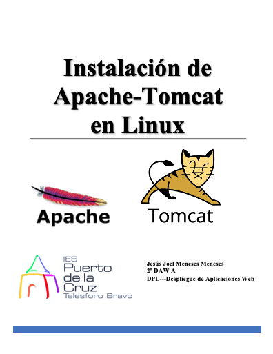

 
 

# Índice #

## 1. Requisitos previos a la instalación. ##
* ### 1.2 Instalación de Open-JDK en el S.O. ###

## 2. Pasos para realizar la instalación. ##
* ### 2.1 Actualización de los repositorios. ###
* ### 2.2 Instalación de Apache-Tomcat. ###
* ### 2.3 Acceso a Apache-Tomcat. ###
  * #### 2.3.1 Problemas de acceso a Apache-Tomcat. ####

