 

**Índice**

*****1.1 Mostrar el historial de cambios del repositorio*****

*****1.2 Crear la carpeta capítulos y crear dentro de ella el fichero capitulo1.txt con el texto siguiente:*****

> Git es un sistema de control de versiones ideado por Linus Torvalds.

*****1.3 Añadir los cambios a la zona de intercambio temporal.*****

*****1.4 Hacer commit de los cambios con el mensaje Añadido capítulo 1.*****

*****1.5 Volver a mostrar el historial de cambios del repositorio.*****

*****2.1 Crear el fichero capitulo2.txt en la carpeta capítulos con el siguiente texto.*****

> El flujo de trabajo básico con Git consiste en:  
  > 1- Hacer cambios en el repositorio.  
  > 2- Añadir los cambios a la zona de intercambio temporal.  
  > 3- Hacer un commit de los cambios. 

*****2.2  Añadir los cambios a la zona de intercambio temporal y un commit de los cambios con el mensaje Añadido capitulo 2*****

*****2.3  Mostrar las diferencias entre la ultima y dos versiones anteriores*****

*****3.1  Crear el fichero capitulo3.txt en la carpeta capítulos con el siguiente texto.*****

> Git permite la creación de ramas lo que permite tener distintas versiones del mismo proyecto y trabajar de manera simultanea en ellas.

*****3.2 Añadir los cambios a la zona de intercambio temporal y hacemos un commit de los cambios con el mensaje Añadido capitulo 3.*****

*****3.3 Mostrar las diferencias entre la primera y la ultima versión del repositorio*****

*****3.4 Copiamos el identificador del primer commit y ejecutamos el comando*****

*****4.1 Crear el fichero indice.txt en la siguiente línea*****

> Índice de los capítulos, con conceptos avanzados de git.

*****4.2 Añadir los cambios a la zona de intercambio temporal y un commit de los cambios con el mensaje "Índice de los capítulos, con conceptos avanzados de git.”*****

*****4.3 Mostrar quien ha hecho cambios sobre el fichero índice.txt*****

*****5.1 Crear una nueva rama bibliografía*****

*****5.2 Mostrar las ramas del repositorio.*****

*****6.1 Crear el fichero capítulos/capitulo4.txt el texto siguiente:*****

> En este capítulo veremos cómo usar GitHub para alojar repositorios en remoto.

*****6.2 Añadir los cambios a la zona de intercambio temporal hacemos un commit de los cambios con el mensaje Añadido capitulo 4.*****

*****6.3 Mostrar la historia del repositorio incluyendo todas las ramas*****

*****7.1 Cambiar a la rama bibliografia*****

*****7.2 Crear el fichero bibliografia.txt y añadir la siguiente referencia:*****

> Chacon, S. and Straub, B. Pro Git. Apress.

*****7.3 Añadir los cambios a la zona de intercambio temporal y hacemos un commit de los cambios con el mensaje Añadida primera referencia bibliografica.*****

*****7.4 Mostrar la historia del repositorio incluyendo todas las ramas*****

*****8.1 Fusionar la rama bibliografía con la rama main.*****

*****8.2 Mostrar la historia del repositorio incluyendo todas las ramas.*****

*****8.3 Eliminar la rama bibliografía y mostramos de nuevo la historia del repositorio incluyendo todas las ramas.*****

*****9.1 Crear la rama bibliografia*****

*****9.2 Cambiar a la rama bibliografía.*****

*****9.3 Cambiar el fichero bibliografia.txt para que contenga las siguientes referencias:*****

> Scott Chacon and Ben Straub. Pro Git. Apress.

> Ryan Hodson. Ry’s Git Tutorial. Smashwords (2014)

*****9.4 Cambiar a la rama main.*****

*****9.5 Cambiar el fichero bibliografia.txt para que - contenga las siguientes referencias:*****

> Chacon, S. and Straub, B. Pro Git. Apress.

> Loeliger, J. and McCullough, M. Version control with Git. O’Reilly

*****9.6 Añadir los cambios a la zona de intercambio temporal y hacer un commit con el mensaje “Añadida nueva referencia bibliográfica.”*****

*****9.7 Fusionar la rama bibliografía con la rama main.*****

*****9.8 Resolver el conflicto dejando el fichero bibliografia.txt con las referencias:*****

> Chacon, S. and Straub, B. Pro Git. Apress.

> Loeliger, J. and McCullough, M. Version control with Git. O’Reilly.

*****9.9 Añadir los cambios a la zona de intercambio temporal y hacer un commit con el mensaje “Resuelto conflicto de bibliografía.”*****

*****9.10 Mostrar la historia del repositorio incluyendo todas las ramas.*****
 
 

****
Para hacer estos ejercicios es necesario haber hecho antes los ejercicios sobre historial de
cambios o bien hacer un clon del repositorio remoto https://github.com/jpexposito/libro mediante la siguiente secuencia de comandos:
****
> git clone https://github.com/jpexposito/libro.git 
> cd libro  

*****1.1 Mostrar el historial de cambios del repositorio con el siguiente comando*****

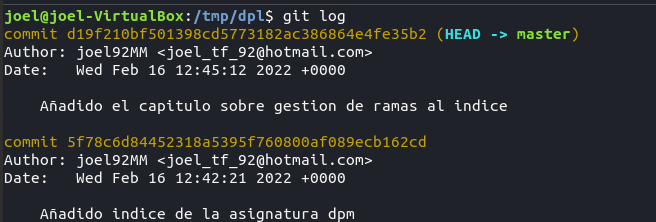

*****1.2 Crear la carpeta capítulos y crear dentro de ella el fichero capitulo1.txt con el texto siguiente:*****

> Git es un sistema de control de versiones ideado por Linus Torvalds.

*****1.3 Añadir los cambios a la zona de intercambio temporal.*****

*****1.4 Hacer commit de los cambios con el mensaje Añadido capítulo 1.*****

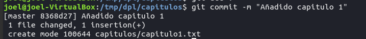

*****1.5 Volver a mostrar el historial de cambios del repositorio.*****

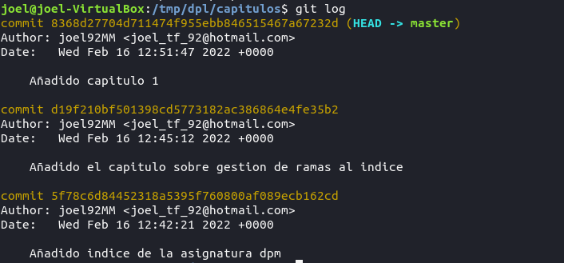

 

*****2.1 Crear el fichero capitulo2.txt en la carpeta capítulos con el siguiente texto.*****

> El flujo de trabajo básico con Git consiste en:  
  > 1- Hacer cambios en el repositorio.  
  > 2- Añadir los cambios a la zona de intercambio temporal.  
  > 3- Hacer un commit de los cambios. 

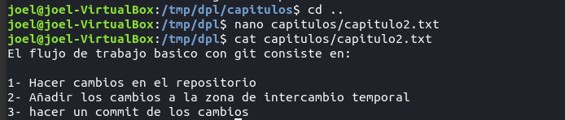

*****2.2  Añadir los cambios a la zona de intercambio temporal y un commit de los cambios con el mensaje Añadido capitulo 2*****
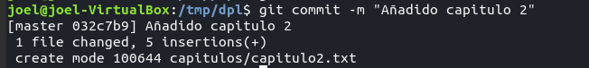

*****2.3  Mostrar las diferencias entre la ultima y dos versiones anteriores*****

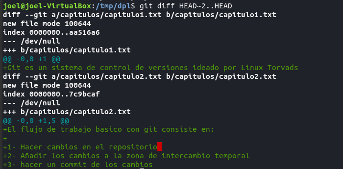
 

*****3.1  Crear el fichero capitulo3.txt en la carpeta capítulos con el siguiente texto.*****

> Git permite la creación de ramas lo que permite tener distintas versiones del mismo proyecto y trabajar de manera simultanea en ellas.

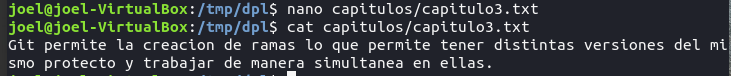

*****3.2 Añadir los cambios a la zona de intercambio temporal y  hacemos un commit de los cambios con el mensaje Añadido capitulo 3.*****

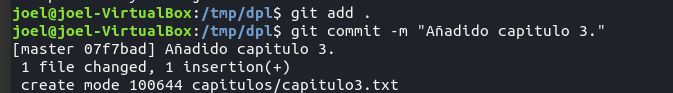

*****3.3 Mostrar las diferencias entre la primera y la ultima versión del repositorio*****

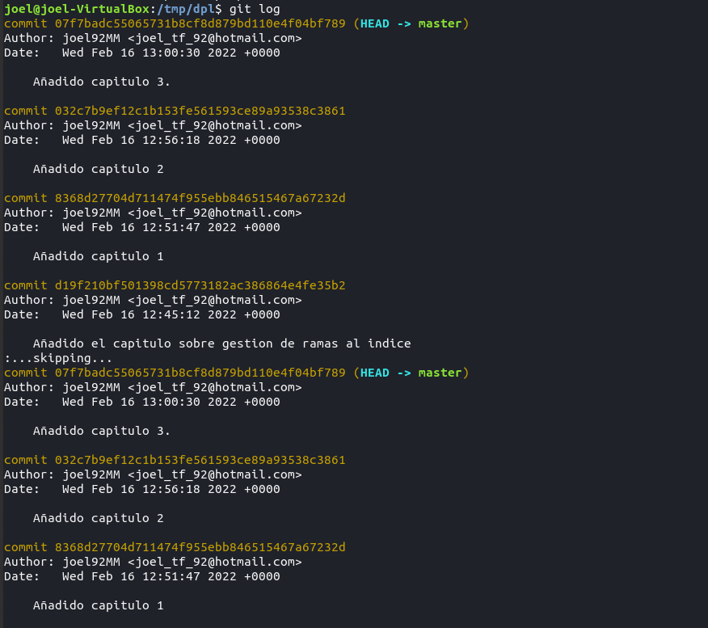

*****3.4 Copiamos el identificador del primer commit y ejecutamos el comando*****

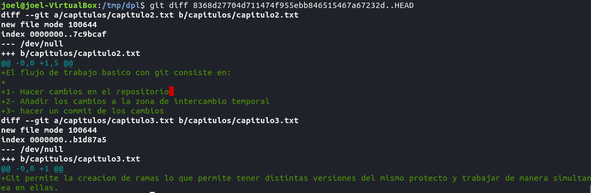

 

*****4.1 Crear el fichero indice.txt en la siguiente línea*****

> Índice de los capítulos, con conceptos avanzados de git.

*****4.2 Añadir los cambios a la zona de intercambio temporal y un commit de los cambios con el mensaje "Índice de los capítulos, con conceptos avanzados de git.”******

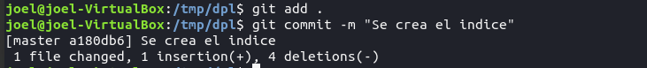

*****4.3 Mostrar quien ha hecho cambios sobre el fichero índice.txt*****

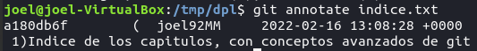

 

*****5.1 Crear una nueva rama bibliografía*****

*****5.2 Mostrar las ramas del repositorio.*****

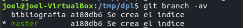

 

*****6.1 Crear el fichero capítulos/capitulo4.txt el texto siguiente:*****

> En este capítulo veremos cómo usar GitHub para alojar repositorios en remoto.

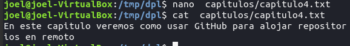

*****6.2 Añadir los cambios a la zona de intercambio temporal t hacemos un commit de los cambios con el mensaje Añadido capitulo 4*****

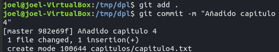

*****6.3 Mostrar la historia del repositorio incluyendo todas las ramas*****

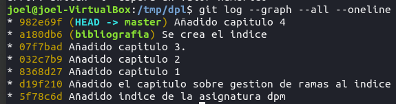

 

*****7.1 Cambiar a la rama bibliografia*****

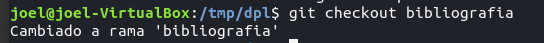

*****7.2 Crear el fichero bibliografia.txt y añadir la siguiente referencia:*****

> Chacon, S. and Straub, B. Pro Git. Apress.

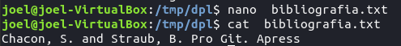

*****7.3 Añadir los cambios a la zona de intercambio temporal y hacemos un commit de los cambios con el mensaje Añadida primera referencia bibliografica*****

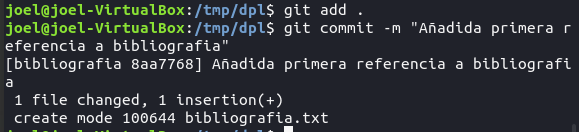

*****7.4 Mostrar la historia del repositorio incluyendo todas las ramas*****

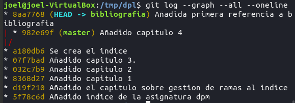

 

*****8.1 Fusionar la rama bibliografía con la rama master.*****

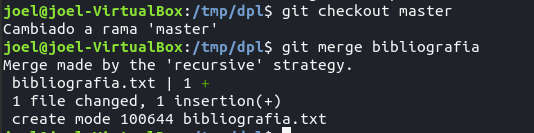

*****8.2 Mostrar la historia del repositorio incluyendo todas las ramas.*****

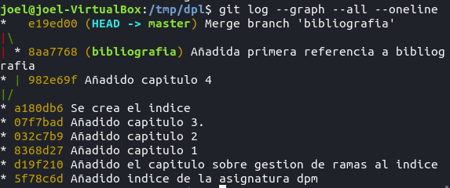

*****8.3 Eliminar la rama bibliografía y mostramos de nuevo la historia del repositorio incluyendo todas las ramas.*****

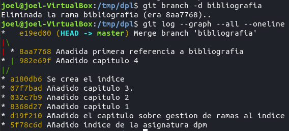

 

*****9.1 Crear la rama bibliografía y cambiamos a la rama bibliografía.*****

*****9.2 Cambiar el fichero bibliografia.txt para que contenga las siguientes referencias:*****

> Scott Chacon and Ben Straub. Pro Git. Apress.

> Ryan Hodson. Ry’s Git Tutorial. Smashwords (2014)

*****9.3 Cambiar a la rama master y modificamos el fichero bibliografia.txt para que - contenga las siguientes referencias:*****

> Chacon, S. and Straub, B. Pro Git. Apress.

> Loeliger, J. and McCullough, M. Version control with Git. O’Reilly.

*****9.4 Hacemos un commit con el mensaje “Añadida nueva referencia bibliográfica.”*****

*****9.7 Fusionar la rama bibliografía con la rama master.*****

*****9.8 Resolver el conflicto dejando el fichero bibliografia.txt con las referencias:*****

> Chacon, S. and Straub, B. Pro Git. Apress.

> Loeliger, J. and McCullough, M. Version control with Git. O’Reilly.

*****9.9 Añadir los cambios a la zona de intercambio temporal y hacemos un commit con el mensaje “Resuelto conflicto de bibliografía.”*****

*****9.10 Mostrar la historia del repositorio incluyendo todas las ramas.*****
