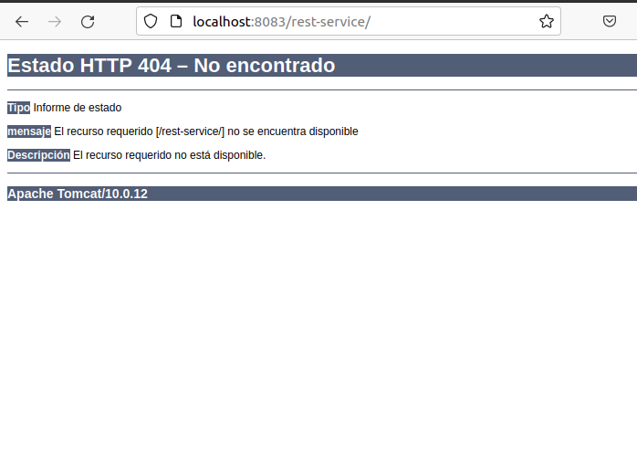
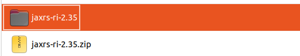
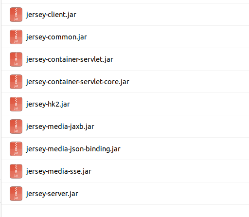
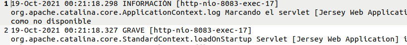

**Editando README**


# Índice #

## 1. Creando nuestro servicio restfulapi. ##

* ### 1.1 Requisitos previos para la instalación ###

* ### 1.2 Construcción del proyecto ###

## 2. Despliegue del servicio ##

* ### 2.1 Consumo del servicio ###
* ### 2.2. Problemas durante el despliegue ###
* ### 2.3. Mejoras en el servicio ###

**1. Creando nuestro servicio restfulapi**

***1.1 Requisitos previos***

Dado que disponemos de Java de las instalaciones anteriores, y también de la instalación de Maven, nos vamos al paso siguiente 

***1.2 Construcción del proyecto***

En el siguiente enlace, disponemos de un proyecto Java, <a href="https://github.com/jpexposito/docencia/tree/master/comun/ejemplos/java/rest-service">enlace</a>

Crearemos el fichero .war

Realizamos las modificaciones en el fichero web.xml 

Movemos el paquete a la carpeta webapps  que se encuentra en la carpeta de instalacion de tomcat

**2. Despliegue del servicio**

Siguiendo los pasos que la anterior tarea, desplegamos el servicio en nuestro servidor de aplicaciones Tomcat

Comprobamos si la aplicacion se ejecuta

***2.1 Consumo del servicio***

Nos descargaremos un cliente rest, desde este <a href="https://install.advancedrestclient.com/install">enlace</a>.

Vamos a la carpeta de logs para buscar el error

Desde la siguiente  <a href="https://eclipse-ee4j.github.io/jersey/download.html"> url, </a>descargamos la libreria, luego la descomprimimos 

Luego copiamos todos los archivos .jar dentro de la carpeta WEB-INFO/lib

Consulto la pagina de logs, y el error sigue

